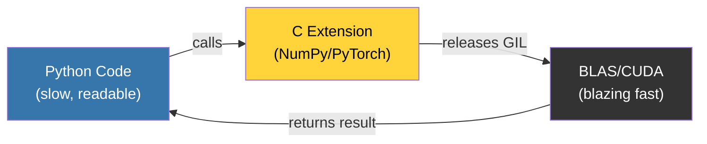

# Scientific & Data: Python sebagai Glue Layer Komputasi Numerik

**"NumPy is just Python, but the heavy lifting is in Fortran."**
*Dominasi Python di Data Science bukan keajaiban — ini rekayasa sistem yang cermat.*

> [!IMPORTANT]
> **Source Link**: [NumPy Internals](https://numpy.org/doc/stable/reference/internals.html) | [Python Data Model](https://docs.python.org/3/reference/datamodel.html)

---

## 1. Definisi & Konsep (The Logic)

Python mendominasi Data Science **bukan karena ia cepat**, melainkan karena ia adalah **Glue Layer** yang sempurna. Pustaka-pustaka kritis seperti NumPy, SciPy, dan PyTorch tidak menjalankan kalkulasi berat di Python objects. Mereka mendelegasikan semua kalkulasi ke **C-Extensions** yang mengakses **BLAS/LAPACK** — pustaka aljabar linear yang ditulis sejak era Fortran 1979.

Python hanya berperan sebagai **interface bersih** di atas mesin tersebut.

### Terminologi Utama (Senior Terms)

| Istilah | Makna Teknis |
| :--- | :--- |
| **BLAS/LAPACK** | *Basic Linear Algebra Subprograms* / *Linear Algebra PACKage* — Fondasi komputasi numerik di balik NumPy operations seperti `np.dot()`. |
| **Contiguous Memory** | Penyimpanan data secara berurutan di RAM (`C-order` vs `Fortran-order`), kunci cache-hit performa GPU. |
| **GIL Release** | Saat NumPy/Pandas melakukan operasi berat, mereka melepas Global Interpreter Lock sehingga thread Python lain bisa berjalan paralel. |
| **`__array_protocol__`** | Standar interface yang memungkinkan berbeda library (NumPy, PyTorch) saling bertukar data tanpa copy. |

---

## 2. Rasionalitas (Why & How?)

### Mengapa Python, Bukan R atau MATLAB?

- **R** lebih dulu di statistika, namun sintaksisnya tidak *generalist* — sulit digunakan untuk build web service atau automation.
- **MATLAB** proprietary, mahal, dan ekosistemnya terisolasi.
- **Python** adalah bahasa *generalist* yang bisa menjadi bahasa *specialist* lewat pustaka. Seorang ilmuwan bisa menulis preprocessing pipeline, model, dan REST API-nya dalam satu bahasa.

### Bagaimana Python Mengakali Kelemahan Sendiri?

Python punya GIL yang membatasi true parallelism. Namun Data Science telah menemukan workaround ini:

1. **C-Extensions меняют GIL** (NumPy, OpenBLAS).
2. **Multiprocessing module** — Gunakan *multiple processes* bukan *threads*.
3. **GPU offloading** — PyTorch/CUDA mengeksekusi tensor di GPU, sepenuhnya di luar GIL.

### Analogi Mendalam: Remote Control Pesawat Ruang Angkasa

Python adalah **Ground Control**. Roketnya (NumPy/GPU) ada di angkasa dan bergerak dengan kecepatan luar biasa. Ground Control tidak harus berlari sekencang roket — tugasnya cukup mengirim perintah yang tepat. Yang penting, Ground Control sangat mudah dipahami oleh seluruh tim insinyur.

---

> [!NOTE]
> **Pengecualian "Nil Content"**: Pembahasan ini bersifat lanskap tingkat tinggi. Detail implementasi `PyObject` buffer protocol, `dtype` internal NumPy, dan `__cuda_array_interface__` akan dibahas di **RAK-05 (Standard Library)** dan **RAK-06 (Interpreters)**.

---
*Back to [BK-02_Landscape](../README.md)*
