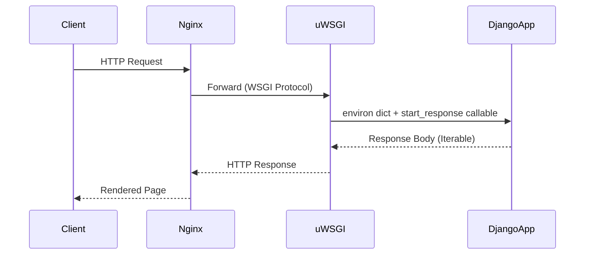

# Web & Automation: Python sebagai Sistem Saraf Infrastruktur

**"Ansible is just Python. Django is Python. Your server config should be Python too."**
*Python memenangkan perang otomasi bukan karena performa, tapi karena ia adalah bahasa yang paling mudah didebug oleh manusia di jam 2 pagi.*

> [!IMPORTANT]
> **Source Link**: [Django Design Philosophies](https://docs.djangoproject.com/en/stable/misc/design-philosophies/) | [WSGI PEP 3333](https://peps.python.org/pep-3333/)

---

## 1. Definisi & Konsep (The Logic)

Di infrastruktur modern, Python memiliki dua peran berbeda yang saling melengkapi:

1. **Web Framework Layer**: Django, FastAPI, Flask — membangun HTTP server, ORM, templating.
2. **Automation & Orchestration Layer**: Ansible, Fabric, Boto3 — mengelola server, cloud resources, dan CI/CD pipelines.

Kedua peran ini dimungkinkan oleh satu kekuatan Python: **Readability as Reliability**. Kode yang mudah dibaca adalah kode yang mudah diaudit, mudah diperbaiki, dan mudah di-handoff antar tim.

### Terminologi Utama (Senior Terms)

| Istilah | Makna Teknis |
| :--- | :--- |
| **WSGI** | *Web Server Gateway Interface* (PEP 333/3333) — Standar sinkron antara server (Nginx/uWSGI) dan aplikasi Python. |
| **ASGI** | *Asynchronous Server Gateway Interface* — Evolusi WSGI untuk mendukung WebSocket dan async I/O (Django Channels, Starlette). |
| **Idempotency** | Prinsip otomasi: menjalankan script yang sama berkali-kali menghasilkan state yang sama. Kunci Ansible playbook. |
| **`asyncio` Event Loop** | Mekanisme internal Python untuk concurrent I/O tanpa threading overhead — fondasi FastAPI dan aiohttp. |

---

## 2. Rasionalitas (Why & How?)

### Bagaimana WSGI/ASGI Memisahkan Server dan Aplikasi?

Tanpa standar ini, setiap framework web harus menulis kode khusus untuk setiap server. WSGI menciptakan kontrak yang jelas:

Django tidak perlu tahu apakah servernya Nginx atau Apache. uWSGI tidak perlu tahu apakah aplikasinya Django atau Flask. **Separation of Concerns** yang murni.

### Mengapa Python Menang di Automation (vs Bash, Ruby)?

- **Bash** powerful tapi sulit dibaca untuk logika kompleks — tidak ada exception handling, tidak ada objek.
- **Ruby/Chef** memiliki ekosistem, namun komunitas infrastruktur berkonvergensi ke Python (Ansible) karena barrier-of-entry yang lebih rendah dan dokumentasi yang lebih baik.
- **Python + Ansible** memungkinkan tim yang sama yang menulis ML model juga bisa menulis deployment pipeline mereka — **satu bahasa untuk seluruh stack**.

### Analogi Mendalam: Sistem Saraf Pusat

Dalam tubuh manusia, **sistem saraf pusat** (otak) tidak menggerakkan otot secara langsung. Ia mengirim sinyal listrik terstandar (ASGI/WSGI) ke saraf-saraf yang menghubungkan relai (uWSGI/Gunicorn). Otot (database, cache, queue) berkontraksi sesuai perintah.

Python adalah **sistem saraf pusat** ini — tidak secepat otot (C/Rust), tetapi koordinasinya adalah yang terbaik.

---

> [!NOTE]
> **Pengecualian "Nil Content"**: Lanskap arsitektural tingkat tinggi. Detail implementasi `asyncio Event Loop`, `GIL` pada I/O-bound tasks, dan `Django ORM query optimization` akan dibahas di **RAK-04 (Core Mechanics)** dan **RAK-06 (Interpreters)**.

---
*Back to [BK-02_Landscape](../README.md)*
