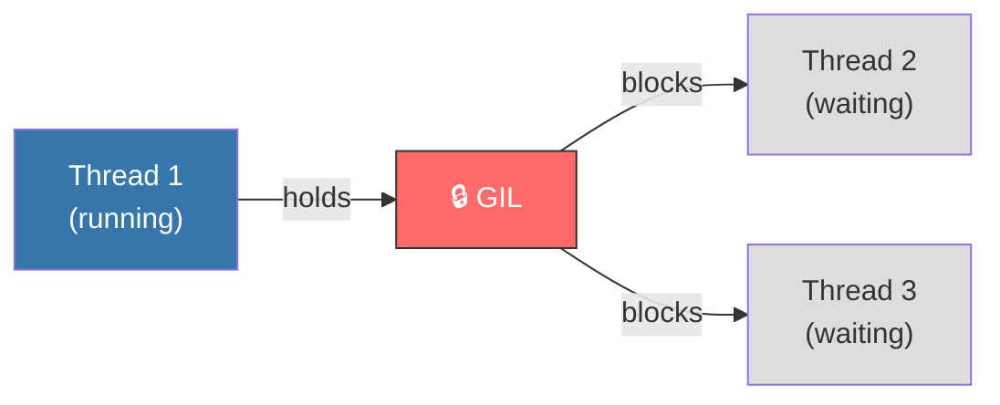

# Python's Weaknesses: Kejujuran Teknis yang Harus Kamu Tahu

**"If you use Python for the wrong job, the wrong job will use you."**
*Setiap arsitek yang jujur mengakui keterbatasan material bangunannya.*

> [!IMPORTANT]
> **Source Link**: [Python FAQ - Why is Python slow?](https://docs.python.org/3/faq/design.html#why-is-python-slower-than-other-implementations) | [PEP 703 -- Making the GIL Optional](https://peps.python.org/pep-0703/)

---

## 1. Definisi & Konsep (The Logic)

Python memiliki **keterbatasan struktural** yang berakar dari keputusan desain awal. Bukan bugs — melainkan necessary trade-offs yang harus dipahami agar bisa disiasati atau dihindari.

### Kelemahan Tier-1: Performa & Concurrency

| Kelemahan | Akar Teknis | Dampak Nyata |
|---|---|---|
| **Global Interpreter Lock (GIL)** | Mutex di CPython yang memastikan hanya satu thread menjalankan bytecode Python pada satu waktu | CPU-bound multi-threaded code tidak bisa memanfaatkan multi-core secara penuh |
| **Interpreted (Bytecode)** | Python dikompilasi ke `.pyc` bytecode lalu dijalankan oleh VM — bukan native machine code | 10–100x lebih lambat dari C/Rust untuk operasi CPU-intensive |
| **High Memory Footprint** | Setiap object Python adalah `PyObject` dengan overhead header ~16–28 bytes | Aplikasi Python menggunakan 3–5x lebih banyak RAM dibanding C untuk data yang sama |
| **Startup Time** | Import system Python membaca disk dan mengeksekusi module-level code | Kurang ideal untuk CLI tools yang dipanggil berkali-kali (vs Go/Rust binary) |

### Kelemahan Tier-2: Typing & Runtime Safety

| Kelemahan | Detail |
|---|---|
| **No Static Type Enforcement** | Type hints bersifat opsional dan tidak di-enforce saat runtime — `mypy` harus dijalankan secara manual |
| **Late Binding Closures** | Variabel dalam lambda/closure dievaluasi saat waktu pemanggilan, bukan deklarasi — sumber bug klasik |
| **Mutable Default Arguments** | `def f(x=[])` berbagi satu list yang sama antar semua pemanggilan — jebakan beginner dan senior |

---

## 2. Rasionalitas (Why & How?)

### GIL: Trade-Off yang Disengaja

GIL ada karena CPython menggunakan **reference counting** untuk garbage collection. Reference counting tidak thread-safe tanpa mutex global. Solusi yang "benar" (menghapus GIL) memerlukan perubahan fundamental pada memory model.

Update terbaru: **PEP 703** (Python 3.13+) sedang mengerjakan *"No-GIL" mode* sebagai opsi eksperimental. Ini adalah perubahan arsitektural terbesar sejak The Great Rift.

### Kapan Python Bukan Pilihan yang Tepat?

1. **System Programming** (kernel drivers, memory-constrained embedded) → Gunakan C/Rust.
2. **Ultra-low latency** (HFT trading, real-time audio) → Gunakan C++/Java.
3. **Heavy CPU-bound parallelism** tanpa C-extensions → Gunakan Go/Rust/Java.
4. **Mobile native apps** → Python tidak ada di App Store/Play Store ekosistem native.

### Analogi Mendalam: Ferrari vs Truk

Python adalah **Truk Cargo yang Sangat Fleksibel** — bisa membawa hampir apapun, bisa dimodifikasi untuk berbagai tugas. Tapi jika lomba kecepatan adalah tujuannya, Anda butuh Ferrari (C/Rust). Insinyur berpengalaman tahu kapan harus menggunakan truk dan kapan harus menyewa Ferrari, tapi tidak mencoba memenangkan Formula 1 dengan truk.

---

## 3. Mitigasi Kelemahan di Dunia Nyata

| Kelemahan | Solusi Standar Industri |
|---|---|
| **GIL** | `multiprocessing`, `asyncio` (I/O-bound), `C extensions` melepas GIL |
| **Kecepatan** | Delegate ke NumPy/Numba/Cython untuk hotspot code |
| **Memory** | Gunakan `__slots__` di class, `array` module, atau `numpy` arrays |
| **Type Safety** | Gunakan `mypy`/`pyright` + type hints secara disiplin di production code |

---

> [!NOTE]
> **Pengecualian "Nil Content"**: Analisis teknis arsitektural. Mekanisme GIL secara mendalam (`ceval.c`, `gil.c`) dan PEP 703 no-GIL implementation akan dibahas di **RAK-06 (Interpreters)**.

---
*Back to [BK-01_TradeOffs](../README.md)*
