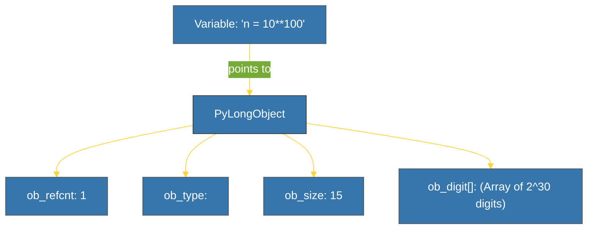

# CH-01: Numbers (The Numerical Atoms) [x] Complete

> **"In Python, integers are not just numbers — they are unlimited precision objects."**

Bab ini membedah tipe data numerik dalam Python (`int`, `float`, `complex`). Kita akan membongkar alasan mengapa Python tidak pernah mengalami *integer overflow* dan bagaimana standar biner IEEE 754 memengaruhi presisi angka desimal.

---

## 🌐 Source Hub (Authority)
- **Primary Source**: [Python Docs - Numeric Types](https://docs.python.org/3/library/stdtypes.html#numeric-types-int-float-complex)
- **CPython Source**: [Objects/longobject.c](https://github.com/python/cpython/blob/main/Objects/longobject.c)
- **Strategic Blueprint**: [RAK-02 Foundation](file:///i:/Workspace/Workspace-Syahputrawork/learning-matrix-blueprint/01-Language-Hubs/Python-Knowledge-Base.md)

---

## 🧠 The Essence (Narrative)
Python menganut prinsip **"Everything is an Object"**. Tipe data `int` bukan sekadar 32-bit atau 64-bit memori, melainkan *Heap-allocated object* yang tumbuh dinamis sesuai kebutuhan (Arbitrary Precision). Ini berarti Anda bisa menghitung faktorial dari 1000 tanpa takut *overflow*. Di sisi lain, `float` di Python adalah implementasi langsung dari standar 64-bit biner IEEE 754, yang membawa konsekuensi presisi pada angka desimal tertentu.

---

## 🎨 Visual Logic (The CPython Integer)



---

## 🛠️ Mechanism (Under the Hood)

### 1. Arbitrary Precision
CPython menyimpan integer besar sebagai array digit dalam basis **2^30**. 
- Perhitungan: `sys.getsizeof(n)` menunjukkan pertumbuhan memori seiring bertambahnya angka.
- Batas: Dibatasi hanya oleh ketersediaan RAM sistem Anda.

### 2. The Floating Trap (IEEE 754)
`0.1 + 0.2` tidak menghasilkan `0.3` secara presisi karena representasi biner. 
- Solusi: Gunakan modul `decimal` untuk presisi finansial atau `math.isclose()` untuk perbandingan.

### 3. Small Integer Cache
CPython mem-prealokasi objek integer dari **-5 hingga 256** untuk meminimalkan overhead alokasi memori. 
```python
a, b = 256, 256
print(a is b) # True (Point to same memory address)
```

---

## 📑 Daftar Bab (The Syllabus)

| Bab/Lab | Fokus | Spesifikasi |
| :--- | :--- | :--- |
| **[01_int_internals.py](./examples/01_int_internals.py)** | Interning Cache | Pembuktian `is` vs `==` & Small Int Cache. |
| **[02_float_precision.py](./examples/02_float_precision.py)** | Floating Point | Demonstrasi IEEE 754 & `decimal` module. |
| **[03_numeric_operations.py](./examples/03_numeric_operations.py)** | Numeric Tower | Bitwise ops & otomatisasi promosi tipe (int -> float). |

---

## ⚠️ Pitfalls
- **`is` for Comparison**: Jangan gunakan kata kunci `is` untuk membandingkan nilai numerik. `is` mengecek alamat memori, bukan kesamaan nilai. Gunakan `==` kecuali Anda sedang membedah identitas memori.
- **Float Comparison**: Hindari `if a == 0.3` saat bekerja dengan hasil perhitungan float. Selalu gunakan margin error atau `math.isclose()`.

---
*Back to [BK-01 Primitives](../README.md)*
