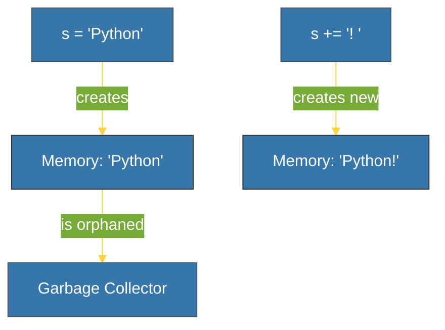

# CH-02: Strings (The Immutable Text) [x] Complete

> **"Strings are the soul of human-machine communication, and in Python, they are carved in stone."**

Bab ini membedah tipe data **`str`** dalam Python. Kita akan mempelajari mengapa string bersifat **Immutable** (tidak dapat diubah) dan bagaimana CPython mengoptimalkan penyimpanan teks melalui mekanisme **String Interning**.

---

## 🌐 Source Hub (Authority)
- **Primary Source**: [Python Docs - Text Sequence Type (str)](https://docs.python.org/3/library/stdtypes.html#text-sequence-type-str)
- **Strategic Blueprint**: [RAK-02 Foundation](file:///i:/Workspace/Workspace-Syahputrawork/learning-matrix-blueprint/01-Language-Hubs/Python-Knowledge-Base.md)

---

## 🧠 The Essence (Narrative)
Python memperlakukan string sebagai urutan karakter Unicode yang **Immutable**. Sekali sebuah string dibuat di memori, isinya tidak dapat dimodifikasi. Jika Anda mencoba mengubah satu karakter, Python sebenarnya akan menciptakan objek string baru yang benar-benar berbeda. Sifat ini memberikan jaminan keamanan data (thread-safe) dan memungkinkan Python melakukan optimasi memori secara agresif.

---

## 🎨 Visual Logic (String Immutability)

---

## 🛠️ Mechanism (Under the Hood)

### 1. String Interning
Python secara otomatis menyimpan satu salinan untuk string pendek dan konstanta teks tertentu. 
- **Tujuan**: Menghemat RAM dan mempercepat perbandingan identitas (`is`).
- **Bukti**: `a = "hello"; b = "hello"; print(a is b)` akan menghasilkan `True`.

### 2. Concatenation vs `.join()`
Karena sifatnya yang immutable, melakukan `s += word` di dalam loop sangat tidak efisien (O(n²)) karena Python terus membuat objek baru. 
- **Solusi**: Gunakan `''.join(list_of_strings)` yang mengalokasikan memori sekaligus (O(n)).

---

## 📑 Lab Praktis (The Examples)

| File | Topik |
| :--- | :--- |
| **[string_internals.py](./examples/string_internals.py)** | Interning & ID Memory. |
| **[string_joining_efficiency.py](./examples/string_joining_efficiency.py)** | Performa `+` vs `.join()`. |

---

## ⚠️ Pitfalls
- **Loop Concatenation**: Jangan pernah mengumpulkan teks menggunakan operator `+` di dalam loop besar. Ini adalah penyebab umum degradasi performa di Python.
- **Index Modification**: Mencoba `s[0] = 'z'` akan menghasilkan `TypeError`. Gunakan slicing atau konversi ke `list` jika butuh modifikasi karakter.

---
*Back to [BK-01 Primitives](../README.md)*
