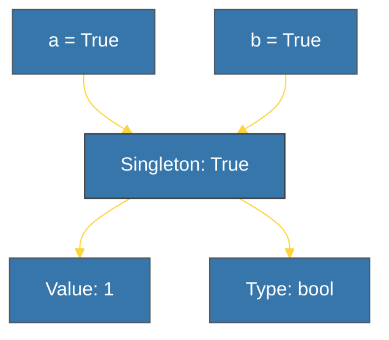

# CH-03: Booleans (The Logic Atoms) [x] Complete

> **"Truth in Python is a number, and a number is a singleton."**

Bab ini membedah tipe data **`bool`** (`True` dan `False`). Kita akan mempelajari mengapa Boolean di Python sebenarnya adalah Integer di balik layar dan bagaimana CPython mengelola objek ini sebagai **Singleton**.

---

## 🌐 Source Hub (Authority)
- **Primary Source**: [Python Docs - Boolean Type (bool)](https://docs.python.org/3/library/stdtypes.html#boolean-values)
- **Strategic Blueprint**: [RAK-02 Foundation](file:///i:/Workspace/Workspace-Syahputrawork/learning-matrix-blueprint/01-Language-Hubs/Python-Knowledge-Base.md)

---

## 🧠 The Essence (Narrative)
Python memiliki sejarah unik dengan Boolean. Secara teknis, `bool` adalah **subclass dari `int`**. Artinya, `True` bernilai `1` dan `False` bernilai `0`. Keunikan lainnya adalah optimasi memori CPython: hanya ada *satu* objek `True` dan *satu* objek `False` di seluruh siklus hidup program. Objek ini disebut **Singleton**, yang memungkinkan perbandingan identitas (`is`) dilakukan secara instan.

---

## 🎨 Visual Logic (The Boolean Singleton)



---

## 🛠️ Mechanism (Under the Hood)

### 1. Integer Heritage
Karena Boolean adalah subclass `int`, Anda bisa melakukan operasi matematika dengannya (meskipun jarang disarankan):
```python
print(True + True) # Hasil: 2
```

### 2. Singleton Identity
Karena hanya ada satu objek di memori, perbandingan identitas selalu berhasil:
```python
x = (1 < 2)
print(x is True) # Hasil: True
```

---

## 📑 Lab Praktis (The Examples)

| File | Topik |
| :--- | :--- |
| **[boolean_logic_internals.py](./examples/boolean_logic_internals.py)** | Identitas Singleton & Integer Heritage. |

---

## ⚠️ Pitfalls
- **`is` vs `==` for Booleans**: Meskipun `is True` bekerja karena sifat Singleton-nya, konvensi Python yang paling Pythonic (PEP 8) menyarankan penggunaan struktur implisit: `if x:` daripada `if x == True:` atau `if x is True:`.
- **Inheritance Trap**: Berhati-hatilah saat melakukan cek tipe data. `isinstance(True, int)` akan mengembalikan `True`, karena Boolean memanglah sebuah integer.

---
*Back to [BK-01 Primitives](../README.md)*
