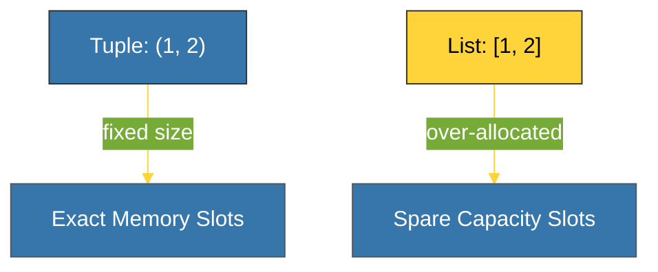

# CH-02: Tuples (The Immutable Record) [x] Complete

> **"A tuple is not a constant list; it is a data record with fixed identity."**

Bab ini membedah **`tuple`** dalam Python — struktur data linier yang bersifat **Immutable**. Kita akan mempelajari mengapa Tuple lebih hemat memori daripada List dan perannya yang krusial sebagai "kunci" dalam pemetaan data.

---

## 🌐 Source Hub (Authority)
- **Primary Source**: [Python Docs - Tuples](https://docs.python.org/3/tutorial/datastructures.html#tuples-and-sequences)
- **CPython Source**: [Objects/tupleobject.c](https://github.com/python/cpython/blob/main/Objects/tupleobject.c)
- **Strategic Blueprint**: [RAK-02 Foundation](file:///i:/Workspace/Workspace-Syahputrawork/learning-matrix-blueprint/01-Language-Hubs/Python-Knowledge-Base.md)

---

## 🧠 The Essence (Narrative)
Secara teknis, Tuple adalah **Fixed-size Array**. Karena ia tidak bisa diubah (Immutable) setelah diciptakan, Python tidak perlu melakukan *over-allocation* seperti pada List. Hal ini membuat Tuple jauh lebih ringan di memori. Selain itu, karena isinya tetap, Tuple bersifat **Hashable** selama seluruh elemen di dalamnya juga hashable. Sifat ini memungkinkan Tuple digunakan sebagai kunci (`key`) dalam Dictionary.

---

## 🎨 Visual Logic (Tuple Memory Efficiency)



---

## 🛠️ Key Characteristics

### 1. Heterogeneous Data
Tuple sering digunakan untuk menyimpan "record" data yang memiliki arti berbeda di setiap posisi (misal: `(x, y, z)` koordinat atau `('Admin', 101)` user role).

### 2. Hash-ability
```python
# Tuple bisa jadi kunci Dict
d = { (1, 2): "Coordinate A" } 
# List TIDAK bisa (TypeError: unhashable type: 'list')
```

---

## ⚠️ Pitfalls
- **The One-Element Trap**: Mendefinisikan tuple dengan satu elemen membutuhkan koma, jika tidak Python akan menganggapnya sebagai tanda kurung biasa: `(1)` adalah integer, `(1,)` adalah tuple.
- **Reference Mutation**: Meskipun Tuple itu sendiri immutable, jika ia berisi objek mutable (seperti list), isi list tersebut tetap bisa diubah. Namun, identitas list di dalam tuple tetap sama.

---
*Back to [BK-01 Sequences](../README.md)*
