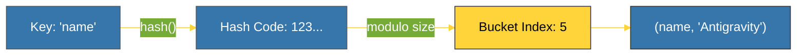

# CH-01: Dictionaries (The Key-Value Map) [x] Complete

> **"Dictionaries are the bedrock of Python's implementation; almost everything is a dict under the hood."**

Bab ini membedah **`dict`** dalam Python — struktur data pemetaan yang sangat dioptimalkan. Kita akan membongkar bagaimana Python melakukan pencarian instan (**O(1)**) menggunakan mekanisme **Hashing**.

---

## 🌐 Source Hub (Authority)
- **Primary Source**: [Python Docs - Dictionaries](https://docs.python.org/3/tutorial/datastructures.html#dictionaries)
- **CPython Source**: [Objects/dictobject.c](https://github.com/python/cpython/blob/main/Objects/dictobject.c)
- **Strategic Blueprint**: [RAK-02 Foundation](file:///i:/Workspace/Workspace-Syahputrawork/learning-matrix-blueprint/01-Language-Hubs/Python-Knowledge-Base.md)

---

## 🧠 The Essence (Narrative)
Dictionary adalah implementasi dari **Hash Map**. Saat Anda menyimpan `d['key'] = 'value'`, Python menghitung kode hash dari `'key'`, memetakannya ke indeks dalam tabel, dan menyimpan `'value'` di sana. Sejak Python 3.7, implementasi internalnya berubah menjadi *Compact Dict* yang tidak hanya lebih hemat memori tetapi juga secara otomatis **mempertahankan urutan penyisipan** (*Insertion Order*).

---

## 🎨 Visual Logic (The Hashing Process)

---

## 🛠️ Performance Matrix (Big O)

| Operation | Complexity (Avg) | Note |
| :--- | :--- | :--- |
| `d[key]` (Look up) | **O(1)** | Constant time access. |
| `d[key] = val` | **O(1)** | Fast insertion. |
| `del d[key]` | **O(1)** | Fast deletion. |
| `key in d` | **O(1)** | Menentukan keberadaan kunci secara instan. |

---

## ⚠️ Pitfalls
- **Unhashable Keys**: Anda tidak bisa menggunakan objek mutabel (seperti List) sebagai kunci Dictionary karena nilainya bisa berubah, yang akan merusak integritas hash.
- **Runtime Error**: Jangan mengubah ukuran dictionary (menambah/menghapus kunci) saat Anda sedang melakukan iterasi di dalamnya. Gunakan `list(d.keys())` sebagai salinan jika perlu modifikasi saat iterasi.

---
*Back to [BK-02 Mappings & Sets](../README.md)*
