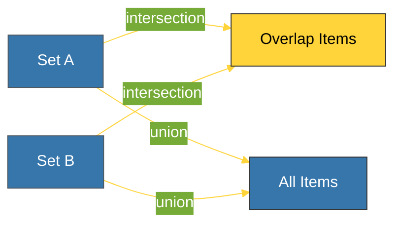

# CH-02: Sets (The Unique Huddle) [x] Complete

> **"A set is a dictionary where keys are the values themselves."**

Bab ini membedah **`set`** dalam Python — koleksi elemen unik yang tidak berurutan (*unordered*). Kita akan mempelajari bagaimana Set menggunakan mekanisme Hashing untuk menawarkan performa pencarian kilat (**O(1)**) dan memproses operasi teori himpunan matematika secara efisien.

---

## 🌐 Source Hub (Authority)
- **Primary Source**: [Python Docs - Sets](https://docs.python.org/3/library/stdtypes.html#set-types-set-frozenset)
- **CPython Source**: [Objects/setobject.c](https://github.com/python/cpython/blob/main/Objects/setobject.c)
- **Strategic Blueprint**: [RAK-02 Foundation](file:///i:/Workspace/Workspace-Syahputrawork/learning-matrix-blueprint/01-Language-Hubs/Python-Knowledge-Base.md)

---

## 🧠 The Essence (Narrative)
Secara teknis, Set adalah **Hash Table** tanpa nilai (*values*). Setiap elemen dalam Set haruslah bersifat **Hashable** (seperti string, angka, atau tuple). Karena Set tidak mengizinkan duplikasi, memasukkan elemen yang sudah ada tidak akan mengubah apapun. Kegunaan utama Set adalah untuk menghilangkan duplikat secara instan dan melakukan operasi logika himpunan seperti irisan (*intersection*) atau gabungan (*union*) jauh lebih cepat daripada menggunakan loop pada List.

---

## 🎨 Visual Logic (Set Theory Venn)

---

## 🛠️ Set Operations (Mathematics Power)

| Operation | Python Operator | Method Equivalent |
| :--- | :---: | :--- |
| **Union** (Gabungan) | `A | B` | `A.union(B)` |
| **Intersection** (Irisan) | `A & B` | `A.intersection(B)` |
| **Difference** (Selisih) | `A - B` | `A.difference(B)` |
| **Symmetric Diff** | `A ^ B` | `A.symmetric_difference(B)` |

---

## ⚠️ Pitfalls
- **Empty Set Mistake**: Menulis `s = {}` akan membuat Dictionary kosong, bukan Set kosong. Untuk membuat set kosong, Anda **harus** menggunakan `s = set()`.
- **Unhashable Items**: Anda tidak bisa memasukkan List atau Dictionary ke dalam Set (Error: `TypeError: unhashable type`). Gunakan `frozenset` jika Anda membutuhkan elemen yang bersifat seperti set namun tetap immutable.

---
*Back to [BK-02 Mappings & Sets](../README.md)*
