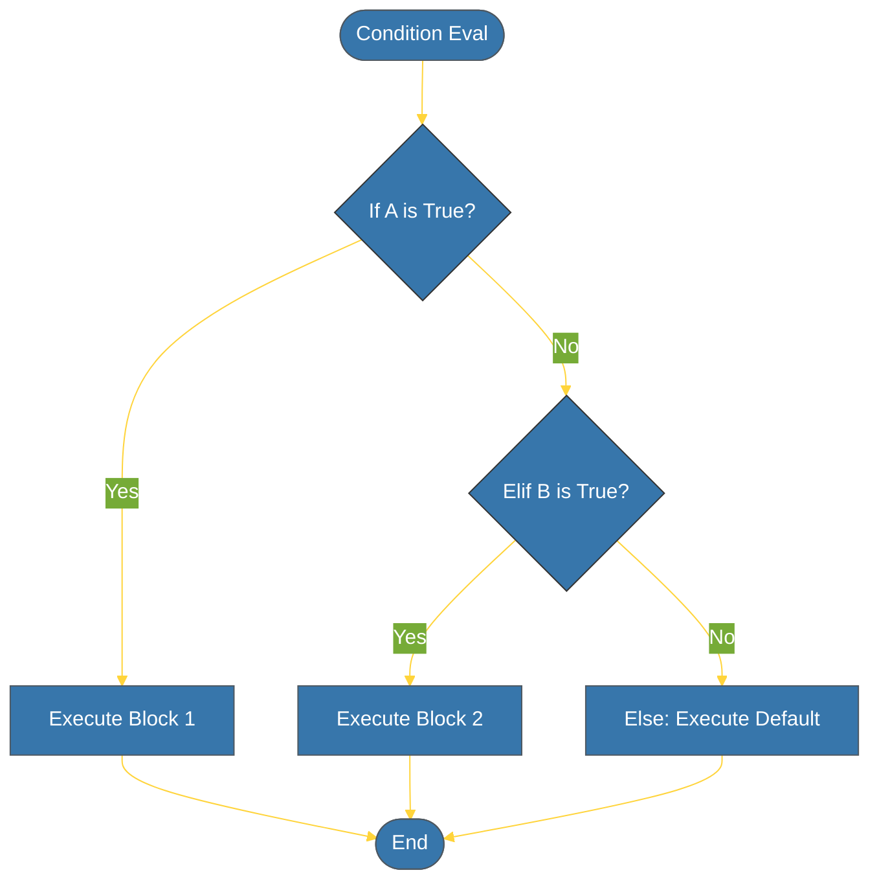

# CH-01: Conditionals (The Logic Gates) [x] Complete

> **"Code is a series of decisions, and conditionals are the gatekeepers."**

Bab ini membedah logika percabangan standar dalam Python menggunakan pernyataan `if`, `elif`, dan `else`. Kita akan mempelajari bagaimana Python menentukan jalur eksekusi berdasarkan evaluasi kebenaran (*Boolean context*).

---

## 🌐 Source Hub (Authority)
- **Primary Source**: [Python Docs - if Statements](https://docs.python.org/3/tutorial/controlflow.html#if-statements)
- **Strategic Blueprint**: [RAK-02 Foundation](file:///i:/Workspace/Workspace-Syahputrawork/learning-matrix-blueprint/01-Language-Hubs/Python-Knowledge-Base.md)

---

## 🧠 The Essence (Narrative)
Percabangan adalah jantung dari logika program. Dalam Python, blok kode ditentukan oleh **indentasi**, bukan kurung kurawal. Saat sebuah kondisi dievaluasi, Python mencari nilai Boolean-nya. Di sini muncul konsep **"Truthiness"**: objek non-Boolean pun bisa dianggap `True` atau `False` (contoh: list kosong `[]` adalah Falsy, sedangkan list berisi `[1]` adalah Truthy).

---

## 🎨 Visual Logic (Decision Flow)

---

## 🛠️ Key Concepts: Truthiness

Python menganggap nilai-nilai berikut sebagai **Falsy**:
- `None`, `False`.
- Angka nol: `0`, `0.0`, `0j`.
- Koleksi kosong: `''`, `()`, `[]`, `{}`, `set()`.

Semua nilai lainnya dianggap **Truthy**.

---

## ⚠️ Pitfalls
- **Indentation Error**: Python sangat sensitif terhadap spasi. Pastikan konsisten menggunakan 4 spasi untuk setiap level indentasi.
- **Exclusive Conditionals**: Ingat bahwa hanya *satu* blok (yang pertama kali benar) yang akan dieksekusi dalam rangkaian `if-elif-else`. Jika Anda ingin mengecek beberapa kondisi secara independen, gunakan rangkaian pernyataan `if` terpisah.

---
*Back to [BK-01 Branching](../README.md)*
