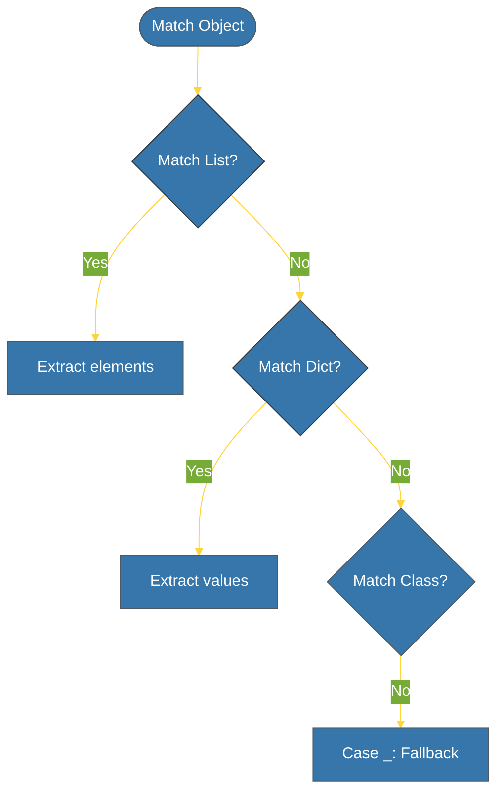

# CH-02: Match-Case (Structural Pattern Matching) [x] Complete

> **"A match-case is more than a switch; it is a powerful destructuring and logic engine."**

Bab ini membedah fitur revolusioner dalam Python 3.10+ — **Structural Pattern Matching** (`match-case`). Ini bukan sekadar pengganti `switch` di bahasa lain, melainkan alat untuk mencocokkan struktur data secara elegan.

---

## 🌐 Source Hub (Authority)
- **Primary Source**: [PEP 634 — Structural Pattern Matching: Specification](https://peps.python.org/pep-0634/)
- **Tutorial**: [What's New In Python 3.10 (Match Case)](https://docs.python.org/3/whatsnew/3.10.html#pep-634-structural-pattern-matching)
- **Strategic Blueprint**: [RAK-02 Foundation](file:///i:/Workspace/Workspace-Syahputrawork/learning-matrix-blueprint/01-Language-Hubs/Python-Knowledge-Base.md)

---

## 🧠 The Essence (Narrative)
Pernyataan `match-case` memungkinkan Anda untuk memetakan objek tidak hanya berdasarkan nilainya saja, melainkan berdasarkan **strukturnya**. Anda bisa mencocokkan list dengan jumlah elemen tertentu, dictionary dengan kunci tertentu, hingga tipe data class kustom. Fitur ini secara drastis menyederhanakan kode yang sebelumnya dipenuhi oleh banyak `if-elif` yang melakukan pengecekan `isinstance()` dan pengecekan manual lainnya.

---

## 🎨 Visual Logic (Match Flow)



---

## 🛠️ Key Capabilities: Destructuring

Salah satu penggunaan terkuat `match-case` adalah **Destructuring**:
```python
match data:
    case [x, y]: # Mencocokkan list berisi tepat 2 elemen
        print(f"Coordinate: {x}, {y}")
    case {"status": "ok", "result": val}: # Mencocokkan Dict dengan key status='ok'
        print(f"Success: {val}")
    case _: # Fallback (Wildcard)
        print("Unknown format")
```

---

## ⚠️ Pitfalls
- **Order Matters**: Python mencocokkan pola dari atas ke bawah. Pola yang lebih spesifik harus diletakkan di atas pola yang lebih umum.
- **Python 3.10 Required**: Menggunakan sintaks ini di versi Python < 3.10 akan menyebabkan `SyntaxError`. Selalu verifikasi lingkungan deployment Anda.

---
*Back to [BK-01 Branching](../README.md)*
