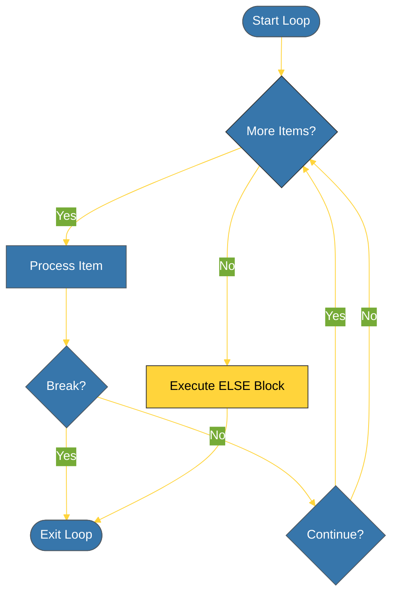

# CH-01: For Loops (The Sequence Walker) [x] Complete

> **"A for loop in Python is not a counter; it is an iterator over a collection."**

Bab ini membedah mekanisme perulangan **`for`** dalam Python. Kita akan mempelajari bagaimana Python berjalan di atas elemen-elemen koleksi dan bagaimana menggunakan perintah kontrol untuk mengarahkan alur iterasi.

---

## 🌐 Source Hub (Authority)
- **Primary Source**: [Python Docs - for Statements](https://docs.python.org/3/tutorial/controlflow.html#for-statements)
- **Strategic Blueprint**: [RAK-02 Foundation](file:///i:/Workspace/Workspace-Syahputrawork/learning-matrix-blueprint/01-Language-Hubs/Python-Knowledge-Base.md)

---

## 🧠 The Essence (Narrative)
Berbeda dengan bahasa C yang menggunakan *counter* (`i++`), `for` loop di Python bekerja dengan mengambil satu per satu elemen dari sebuah **Iterable**. Jika Anda membutuhkan indeks, Anda menggunakan fungsi pembantu seperti `range()` atau `enumerate()`. Python juga menyediakan perintah `break` untuk keluar total, `continue` untuk melompati satu putaran, dan blok `else` yang unik: ia hanya dieksekusi jika loop berjalan hingga selesai tanpa terkena `break`.

---

## 🎨 Visual Logic (Loop Control)

---

## 🛠️ Iteration Utilities

1. **`range(start, stop, step)`**: Menghasilkan deret angka secara efisien (Lazy).
2. **`enumerate(iterable)`**: Memberikan pasangan `(index, item)` secara bersamaan.
3. **`zip(it1, it2)`**: Menggabungkan dua atau lebih koleksi untuk diiterasi paralel.

---

## ⚠️ Pitfalls
- **Modifying Middle-Flight**: Jangan pernah menghapus atau menambah elemen ke dalam list yang sedang Anda iterasi. Ini akan menyebabkan perilaku yang tidak terduga atau melompati elemen.
- **`else` Confusion**: Ingat bahwa blok `else` pada for loop **BUKAN** berarti "jika loop tidak masuk". Sebaliknya, `else` berarti "jika loop berhasil memproses semua item tanpa dihentikan paksa oleh break".

---
*Back to [BK-02 Iteration](../README.md)*
