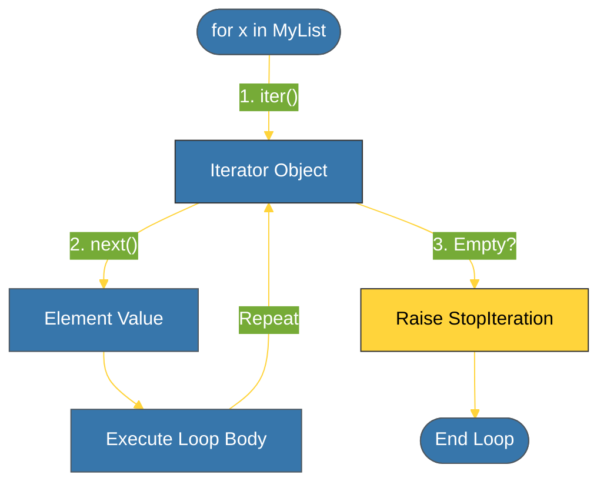

# CH-01: Iterator Protocol (The Engine) [x] Complete

> **"A for loop is just a elegant mask for the Iterator Protocol."**

Bab ini membedah mekanisme internal di balik perulangan Python. Kita akan mempelajari **Iterator Protocol** — standar yang memungkinkan objek apa pun dapat diiterasi menggunakan metode dunder `__iter__` dan `__next__`.

---

## 🌐 Source Hub (Authority)
- **Primary Source**: [Python Docs - Iterators](https://docs.python.org/3/c-api/iter.html)
- **PEP 234**: [Iterators Specification](https://peps.python.org/pep-0234/)
- **Strategic Blueprint**: [RAK-02 Foundation](file:///i:/Workspace/Workspace-Syahputrawork/learning-matrix-blueprint/01-Language-Hubs/Python-Knowledge-Base.md)

---

## 🧠 The Essence (Narrative)
Dalam Python, perulangan `for` sebenarnya melakukan tiga langkah otomatis:
1. Meminta objek **Iterable** (seperti List) untuk memberikan **Iterator** via `__iter__()`.
2. Memanggil `__next__()` pada iterator tersebut berulang kali untuk mendapatkan elemen.
3. Berhenti saat iterator melempar pengecualian **`StopIteration`**.

Memahami protokol ini adalah kunci untuk menciptakan objek kustom yang bisa diiterasi dan menghemat memori karena elemen dihasilkan satu per satu, bukan sekaligus.

---

## 🎨 Visual Logic (Iterator Lifecycle)



---

## 🛠️ Key Definitions

1. **Iterable**: Objek yang memiliki `__iter__()` (seperti `list`, `str`, `dict`).
2. **Iterator**: Objek stateful yang memiliki `__next__()` dan melacak posisi saat ini.

```python
# Manual Iterator Protocol
my_iter = iter([1, 2])
print(next(my_iter)) # 1
print(next(my_iter)) # 2
# print(next(my_iter)) # raises StopIteration!
```

---

## ⚠️ Pitfalls
- **Exhaustion**: Iterator bersifat "sekali pakai". Setelah semua elemen diambil, iterator tersebut menjadi kosong. Anda harus memanggil `iter()` lagi pada objek aslinya jika ingin mengulangi iterasi.
- **Infinite Iterators**: Berhati-hatilah saat membuat iterator kustom. Jika Anda lupa melempar `StopIteration`, perulangan `for` akan berjalan selamanya.

---
*Back to [BK-03 Advanced Flow](../README.md)*
