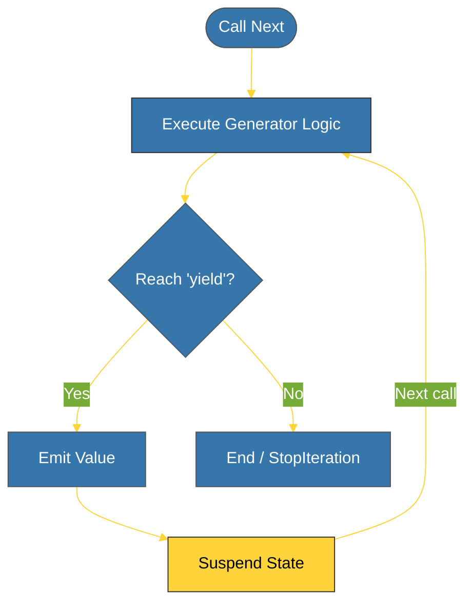

# CH-02: Generators (The Lazy Producers) [x] Complete

> **"A generator doesn't hold data; it holds the logic to produce it one by one."**

Bab ini membedah **`Generators`** dalam Python — senjata rahasia untuk menangani data besar secara efisien. Kita akan mempelajari bagaimana kata kunci **`yield`** memungkinkan fungsi untuk menunda eksekusi dan menghasilkan nilai secara bertahap tanpa memakan banyak RAM.

---

## 🌐 Source Hub (Authority)
- **Primary Source**: [Python Docs - Generator Functions](https://docs.python.org/3/tutorial/classes.html#generators)
- **PEP 255**: [Simple Generators Specification](https://peps.python.org/pep-0255/)
- **Strategic Blueprint**: [RAK-02 Foundation](file:///i:/Workspace/Workspace-Syahputrawork/learning-matrix-blueprint/01-Language-Hubs/Python-Knowledge-Base.md)

---

## 🧠 The Essence (Narrative)
Generators adalah cara paling elegan untuk menerapkan **Lazy Evaluation**. Berbeda dengan fungsi biasa yang mengembalikan (`return`) seluruh hasil sekaligus ke memori, Generator memberikan (`yield`) satu hasil, lalu "tidur" (*suspend*) tepat di baris tersebut. Saat dipanggil lagi, ia akan bangun (*resume*) dan melanjutkan eksekusi dari titik terakhir. Ini memungkinkan pengolahan file log berukuran Gigabyte atau deret angka tak terhingga dengan penggunaan memori yang konstan (hanya satu baris/item pada satu waktu).

---

## 🎨 Visual Logic (Yield & Resume Cycle)



---

## 🛠️ Generator Types

### 1. Generator Functions
Fungsi yang mengandung setidaknya satu pernyataan `yield`:
```python
def count_to_three():
    yield 1
    yield 2
    yield 3
```

### 2. Generator Expressions
Varian "Lazy" dari List Comprehension menggunakan tanda kurung `()`:
```python
# List (Eager) - 1000 item di memori
list_comp = [x**2 for x in range(1000)]

# Generator (Lazy) - 1 item di memori pada satu waktu
gen_exp = (x**2 for x in range(1000))
```

---

## ⚠️ Pitfalls
- **One-Way Street**: Sama seperti Iterator, Generator hanya bisa digunakan sekali. Jika Anda ingin melakukan iterasi kedua, Anda harus mendefinisikan ulang atau memanggil generator tersebut lagi.
- **The Empty Value**: Ingatlah bahwa memanggil fungsi generator tidak langsung menjalankan kodenya, melainkan hanya mengembalikan objek generator. Anda harus memanggil `next()` atau memasukkannya ke dalam loop agar kodenya benar-benar berjalan.

---
*Back to [BK-03 Advanced Flow](../README.md)*
