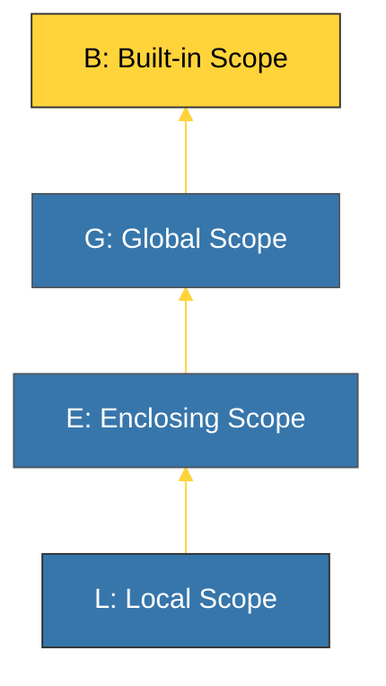

# CH-02: Scopes & Closures (The LEGB Rule) [x] Complete

> **"A variable is only as meaningful as the scope it lives in."**

Bab ini membedah aturan cakupan variabel dalam Python menggunakan standar **LEGB**. Kita akan mempelajari bagaimana Python mencari nama variabel, serta konsep **Closures** di mana fungsi "mengingat" lingkungan tempat ia diciptakan.

---

## 🌐 Source Hub (Authority)
- **Primary Source**: [Python Docs - Scopes and Namespaces](https://docs.python.org/3/tutorial/classes.html#python-scopes-and-namespaces)
- **Strategic Blueprint**: [RAK-02 Foundation](file:///i:/Workspace/Workspace-Syahputrawork/learning-matrix-blueprint/01-Language-Hubs/Python-Knowledge-Base.md)

---

## 🧠 The Essence (Narrative)
Python mencari variabel mengikuti hirarki **LEGB** (Local -> Enclosing -> Global -> Built-in). Jika nama tidak ditemukan di tingkat **Local** (di dalam fungsi), Python naik ke tingkat **Enclosing** (fungsi yang membungkusnya), lalu ke **Global** (level modul), dan terakhir ke **Built-in** (bawaan Python seperti `len`). **Closures** terjadi ketika fungsi dalam mereferensikan variabel dari fungsi luar, memungkinkan fungsi tersebut mempertahankan state tanpa menggunakan Class.

---

## 🎨 Visual Logic (LEGB Hierarchy)



---

## 🛠️ Scope Control Keywords

### 1. `global`
Digunakan di dalam fungsi untuk memodifikasi variabel yang didefinisikan di level modul (Global).
```python
x = 10
def f():
    global x
    x = 20 # Mengubah x global
```

### 2. `nonlocal`
Digunakan di dalam fungsi bersarang (*Nested Function*) untuk memodifikasi variabel dari fungsi pembungkusnya (Enclosing). Ini adalah kunci utama pembuatan **Closures**.

---

## ⚠️ Pitfalls
- **`UnboundLocalError`**: Terjadi jika Anda mencoba mengubah variabel lokal sebelum mendefinisikannya, atau mencoba mengubah variabel luar tanpa menggunakan kata kunci `global`/`nonlocal`.
- **Global Pollution**: Hindari penggunaan variabel global secara berlebihan. Global yang terlalu banyak membuat kode sulit diuji dan didebug secara independen. Gunakan passing argumen sebagai gantinya.

---
*Back to [BK-01 Foundations](../README.md)*
