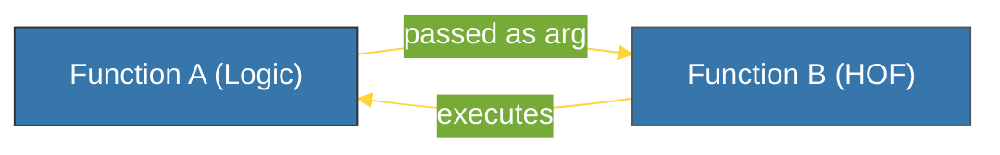

# CH-01: First-Class Objects (Functions as Data) [x] Complete

> **"In Python, a function is not just a block of code; it is an object that can be passed, stored, and manipulated."**

Bab ini membedah sifat dasar fungsi dalam Python sebagai **First-Class Objects**. Kita akan mempelajari mengapa kemampuan ini memungkinkan teknik pemrograman tingkat tinggi seperti *Higher-Order Functions* (HOF).

---

## 🌐 Source Hub (Authority)
- **Primary Source**: [Python Docs - Functions](https://docs.python.org/3/reference/datamodel.html#index-35)
- **Strategic Blueprint**: [RAK-02 Foundation](file:///i:/Workspace/Workspace-Syahputrawork/learning-matrix-blueprint/01-Language-Hubs/Python-Knowledge-Base.md)

---

## 🧠 The Essence (Narrative)
Istilah "First-Class Object" berarti fungsi dalam Python diperlakukan sama dengan objek lainnya (seperti integer atau string). 
Ini berarti Anda bisa:
1. Menetapkan fungsi ke sebuah variabel.
2. Mengirimkan fungsi sebagai argumen ke fungsi lain (**Higher-Order Functions**).
3. Mengembalikan fungsi dari fungsi lain (**Nested Functions/Closures**).
4. Menyimpan fungsi di dalam struktur data (seperti list atau dictionary).

---

## 🎨 Visual Logic (HOF Interaction)



---

## 🛠️ Implementation Examples

### 1. Assigning to Variables
```python
def greet(name):
    return f"Hello {name}"

say_hi = greet # Assigning function to variable
print(say_hi("Antigravity"))
```

### 2. Higher-Order Functions
Fungsi `map()` dan `filter()` adalah contoh bawaan HOF. Begitu juga decorator yang akan kita pelajari di Buku-03.

---

## ⚠️ Pitfalls
- **Missing Parentheses Confusion**: Sering terjadi kebingungan antara mengirim referensi fungsi (`func`) dan memanggil fungsi tersebut (`func()`). Ingat: tanpa tanda kurung, Anda mengirim "otak" fungsi; dengan tanda kurung, Anda mengirim "hasil" dari fungsi tersebut.

---
*Back to [BK-02 Functional Pattern](../README.md)*
