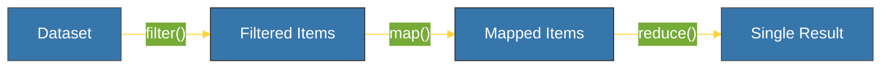

# CH-02: Lambdas & Functional Tools (Anonymous Power) [x] Complete

> **"A lambda is a quick thought that doesn't need a name."**

Bab ini membedah **`lambda`** — fungsi anonim satu baris dalam Python, serta utilitas pemrosesan fungsional seperti **`map()`**, **`filter()`**, dan **`reduce()`**. Kita akan mempelajari kapan harus menggunakan mereka untuk efisiensi dan kapan harus menghindarinya demi keterbacaan.

---

## 🌐 Source Hub (Authority)
- **Primary Source**: [Python Docs - Lambda Expressions](https://docs.python.org/3/tutorial/controlflow.html#lambda-expressions)
- **Functional Programming**: [Functional Programming Modules (functools)](https://docs.python.org/3/library/functools.html)
- **Strategic Blueprint**: [RAK-02 Foundation](file:///i:/Workspace/Workspace-Syahputrawork/learning-matrix-blueprint/01-Language-Hubs/Python-Knowledge-Base.md)

---

## 🧠 The Essence (Narrative)
**Lambda** adalah cara cepat untuk mendefinisikan fungsi tanpa menamainya. Ia hanya bisa berisi satu ekspresi dan secara otomatis mengembalikannya. Lambda paling sering digunakan sebagai argumen untuk fungsi tingkat tinggi (Higher-Order Functions) seperti `map()` (mengubah setiap elemen), `filter()` (memilih elemen tertentu), dan `reduce()` (mengakumulasi elemen menjadi satu nilai).

---

## 🎨 Visual Logic (Functional Pipeline)



---

## 🛠️ Implementation Syntax

### 1. Lambda Definition
```python
# Sintaks: lambda arguments: expression
add = lambda x, y: x + y
print(add(5, 3)) # 8
```

### 2. Functional Tools
```python
nums = [1, 2, 3, 4]
squares = list(map(lambda x: x**2, nums)) # [1, 4, 9, 16]
evens = list(filter(lambda x: x % 2 == 0, nums)) # [2, 4]
```

---

## ⚠️ Pitfalls
- **Readability over Brevity**: Jangan memaksakan penggunaan Lambda jika logikanya rumit. Jika butuh lebih dari satu baris atau kontrol `if-else` yang kompleks, gunakan fungsi `def` standar.
- **List Comprehensions vs Map/Filter**: Di Python Modern, `list comprehension` seringkali dianggap lebih terbaca daripada kombinasi `map()` dan `lambda`. Pilih yang paling mudah dimengerti oleh rekan satu tim.

---
*Back to [BK-02 Functional Pattern](../README.md)*
