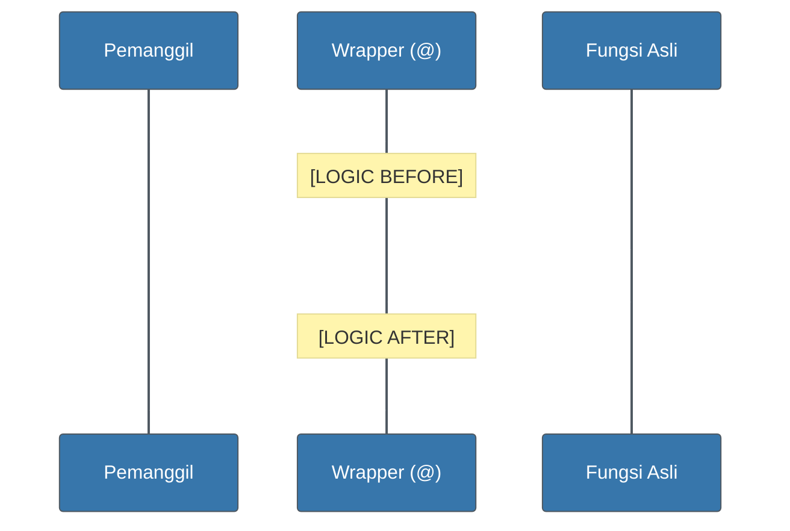

# CH-01: Decorators (The Wrapper Pattern) [x] Complete

> **"A decorator is a function that takes a function and returns a function, adding a layer of logic without changing the core."**

Bab ini membedah salah satu fitur paling "ajaib" dan kuat dalam Python — **Decorators**. Kita akan mempelajari bagaimana menggunakan simbol **`@`** untuk membungkus fungsi dan menambahkan perilaku baru (seperti logging, timing, atau auth) secara modular.

---

## 🌐 Source Hub (Authority)
- **Primary Source**: [Python Docs - Decorators](https://docs.python.org/3/glossary.html#term-decorator)
- **Advanced Resource**: [Primer on Python Decorators (Real Python)](https://realpython.com/primer-on-python-decorators/)
- **Strategic Blueprint**: [RAK-02 Foundation](file:///i:/Workspace/Workspace-Syahputrawork/learning-matrix-blueprint/01-Language-Hubs/Python-Knowledge-Base.md)

---

## 🧠 The Essence (Narrative)
Decorators adalah implementasi praktis dari **Higher-Order Functions** dan **Closures**. 
Secara mekanis, saat Anda menulis:
```python
@my_decorator
def my_func():
    pass
```
Python sebenarnya melakukan hal ini di balik layar: `my_func = my_decorator(my_func)`. Ini memungkinkan Anda untuk "menyuntikkan" kode sebelum dan sesudah eksekusi fungsi asli tanpa menyentuh baris kode di dalam fungsi asli tersebut.

---

## 🎨 Visual Logic (Execution Pipeline)



---

## 🛠️ The Essential Wrapper Pattern

Untuk membuat decorator yang profesional, gunakan **`functools.wraps`** agar metadata fungsi asli (nama, docstring) tidak tertimpa oleh wrapper.

```python
from functools import wraps

def debug(func):
    @wraps(func)
    def wrapper(*args, **kwargs):
        print(f"Calling {func.__name__}...")
        return func(*args, **kwargs)
    return wrapper
```

---

## ⚠️ Pitfalls
- **Metadata Loss**: Selalu gunakan `@wraps(func)` pada fungsi dalam. Tanpa ini, fungsi Anda akan terlihat bernama `"wrapper"` bagi debugger atau alat dokumentasi.
- **Complexity Trap**: Decorator sangat mumpuni, tetapi jangan gunakan untuk logika yang terlalu rumit sehingga menyembunyikan perilaku penting dari pengembang lain.

---
*Back to [BK-03 Decorators](../README.md)*
