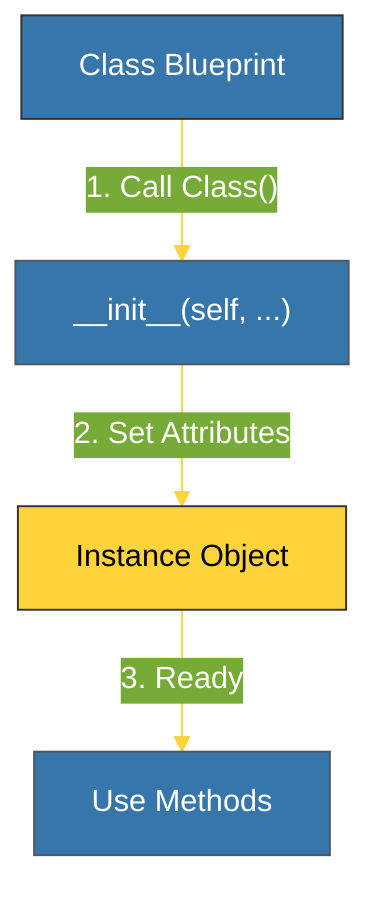

# CH-01: Class Syntax (The Blueprint) [x] Complete

> **"A class is a blueprint; an object is the house built from that blueprint."**

Bab ini membedah sintaks dasar pembuatan kelas dalam Python. Kita akan mempelajari bagaimana mendefinisikan struktur data kustom menggunakan kata kunci `class` dan bagaimana metode spesial `__init__` menghidupkan objek tersebut.

---

## 🌐 Source Hub (Authority)
- **Primary Source**: [Python Docs - Classes](https://docs.python.org/3/tutorial/classes.html)
- **Strategic Blueprint**: [RAK-02 Foundation](file:///i:/Workspace/Workspace-Syahputrawork/learning-matrix-blueprint/01-Language-Hubs/Python-Knowledge-Base.md)

---

## 🧠 The Essence (Narrative)
Kelas adalah cara kita mengelompokkan data (atribut) dan perilaku (metode) menjadi satu unit logis. Dalam Python, setiap metode dalam kelas harus menerima parameter pertama yang secara konvensi dinamakan **`self`**. `self` adalah referensi ke *instance* spesifik dari kelas tersebut. Tanpa `self`, Python tidak akan tahu atribut milik objek mana yang sedang Anda akses atau modifikasi.

---

## 🎨 Visual Logic (Instantiation Flow)



---

## 🛠️ Basic Implementation

```python
class Robot:
    def __init__(self, name):
        self.name = name # Attribute attached to instance
        
    def say_hello(self):
        return f"Hello, I am {self.name}"

# Instantiation
droid = Robot("R2-D2")
print(droid.say_hello())
```

---

## ⚠️ Pitfalls
- **The `self` Omission**: Lupa menyertakan `self` pada definisi metode adalah kesalahan paling umum bagi pemula. Jika terlewat, Anda akan mendapatkan `TypeError` saat memanggil metode tersebut karena Python secara otomatis mengirimkan referensi instance sebagai argumen pertama.
- **Empty `__init__`**: Jika Anda tidak butuh inisialisasi awal, Anda boleh melewatkan `__init__`, namun biasanya ini menunjukkan bahwa kelas tersebut mungkin lebih cocok menjadi kumpulan fungsi statis.

---
*Back to [BK-01 Classes & Objects](../README.md)*
