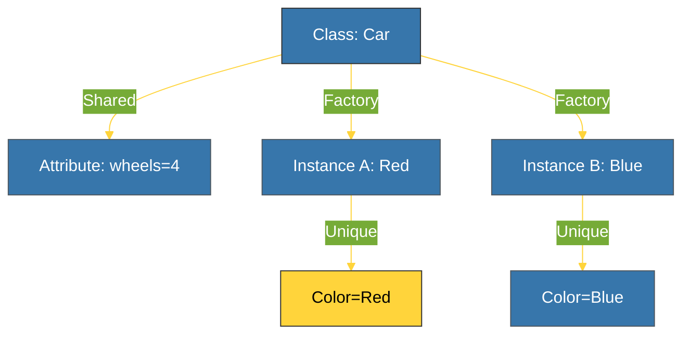

# CH-02: Attributes & Methods (Scoped Logic) [x] Complete

> **"Data and behavior can exist at the level of the individual (instance) or the collection (class)."**

Bab ini membedah perbedaan cakupan antara atribut **Instance** dan atribut **Class**, serta penggunaan tiga jenis metode utama dalam Python: **Instance**, **Class**, dan **Static Methods**.

---

## 🌐 Source Hub (Authority)
- **Primary Source**: [Python Docs - Class and Instance Variables](https://docs.python.org/3/tutorial/classes.html#class-and-instance-variables)
- **Strategic Blueprint**: [RAK-02 Foundation](file:///i:/Workspace/Workspace-Syahputrawork/learning-matrix-blueprint/01-Language-Hubs/Python-Knowledge-Base.md)

---

## 🧠 The Essence (Narrative)
Secara mendasar, **Instance Attributes** unik bagi setiap objek (misal: warna mobil), sedangkan **Class Attributes** dibagi bersama oleh seluruh instance dari kelas tersebut (misal: jumlah ban mobil). Demikian pula dengan metode:
1. **Instance Methods**: Mengakses data spesifik objek via `self`.
2. **Class Methods**: Mengakses data kelas via `cls` (menggunakan `@classmethod`).
3. **Static Methods**: Tidak mengakses data instance maupun kelas (menggunakan `@staticmethod`), hanya fungsi utilitas yang dikelompokkan dalam kelas.

---

## 🎨 Visual Logic (Scoping Diagram)

---

## 🛠️ Implementation Matrix

| Type | Decorator | First Arg | Usage |
| :--- | :--- | :--- | :--- |
| **Instance** | None | `self` | Mengurus data unik objek. |
| **Class** | `@classmethod` | `cls` | Factory methods atau mengubah state kelas. |
| **Static** | `@staticmethod` | None | Utilitas murni yang logikanya terkait kelas. |

---

## ⚠️ Pitfalls
- **Shared Mutable Class Attributes**: Hati-hati saat mendefinisikan list atau dict sebagai Class Attribute. Jika satu instance memodifikasi list tersebut, perubahannya akan terlihat pada **seluruh** instance lain karena mereka menunjuk ke referensi objek yang sama di memori.
- **Instance shadowing**: Jika Anda mencoba menulis ke Class Attribute melalui instance (`obj.class_attr = val`), Python akan membuat Instance Attribute baru dengan nama yang sama, menutupi (*shadowing*) Class Attribute aslinya hanya untuk instance tersebut.

---
*Back to [BK-01 Classes & Objects](../README.md)*
