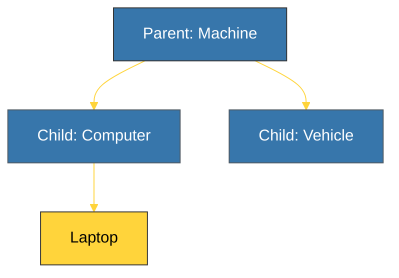

# CH-01: Inheritance & Polymorphism (Structural Hierarchy) [x] Complete

> **"Inheritance allows us to define a class that takes all the functionality from a parent class and allows us to add more."**

Bab ini membedah **Pewarisan (Inheritance)** dan **Polimorfisme** — dua pilar utama OOP yang memungkinkan kita membangun struktur kode yang hierarkis dan dapat digunakan kembali (*reusable*).

---

## 🌐 Source Hub (Authority)
- **Primary Source**: [Python Docs - Inheritance](https://docs.python.org/3/tutorial/classes.html#inheritance)
- **Strategic Blueprint**: [RAK-02 Foundation](file:///i:/Workspace/Workspace-Syahputrawork/learning-matrix-blueprint/01-Language-Hubs/Python-Knowledge-Base.md)

---

## 🧠 The Essence (Narrative)
Pewarisan memungkinkan kelas anak (*subclass*) untuk mewarisi atribut dan metode dari kelas induk (*superclass*). Python mendukung **Method Overriding**, di mana kelas anak dapat memberikan implementasi spesifik untuk metode yang sudah ada di induk. Gunakan fungsi **`super()`** jika Anda ingin menjalankan logika induk sebelum atau sesudah logika anak. Selain itu, Python menganut **Duck Typing** ("Jika ia berjalan seperti bebek dan bersuara seperti bebek, maka ia adalah bebek") — sebuah bentuk polimorfisme dinamis di mana tipe objek ditentukan oleh perilakunya, bukan posisinya dalam hirarki kelas.

---

## 🎨 Visual Logic (Inheritance Tree)



---

## 🛠️ Implementation Example: `super()`

```python
class Bird:
    def fly(self):
        return "I am flying!"

class Penguin(Bird):
    def fly(self):
        # Overriding: Penguin cannot fly
        return "I cannot fly, but I can swim!"
    
    def move(self):
        return super().fly() # Accessing parent method logic (if needed)

p = Penguin()
print(p.fly()) # Polymorphic behavior
```

---

## ⚠️ Pitfalls
- **Deep Hierarchies**: Hindari membuat hirarki pewarisan yang terlalu dalam (lebih dari 3 level). Ini membuat kode sulit dipahami dan didebug. Gunakan prinsip **Composition over Inheritance** jika memungkinkan.
- **`super().__init__()`**: Lupa memanggil inisialisasi induk di dalam `__init__` anak akan menyebabkan atribut induk tidak terinisialisasi, memicu `AttributeError` saat diakses.

---
*Back to [BK-02 Inheritance & Polymorphism](../README.md)*
