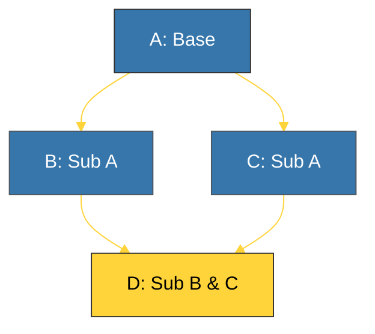

# CH-02: Multiple Inheritance & MRO (The Diamond Solver) [x] Complete

> **"Multiple inheritance allows a class to derive from more than one base class, but it requires a strict order of resolution."**

Bab ini membedah fitur canggih namun kompleks dalam Python — **Multiple Inheritance (Pewarisan Ganda)** — dan bagaimana Python menyelesaikan konflik nama menggunakan **Method Resolution Order (MRO)**.

---

## 🌐 Source Hub (Authority)
- **Primary Source**: [Python Docs - Multiple Inheritance](https://docs.python.org/3/tutorial/classes.html#multiple-inheritance)
- **Technical Detail**: [The Python 2.3 Method Resolution Order (C3 Linearization)](https://www.python.org/download/releases/2.3/mro/)
- **Strategic Blueprint**: [RAK-02 Foundation](file:///i:/Workspace/Workspace-Syahputrawork/learning-matrix-blueprint/01-Language-Hubs/Python-Knowledge-Base.md)

---

## 🧠 The Essence (Narrative)
Pewarisan ganda terjadi saat sebuah kelas memiliki lebih dari satu induk. Masalah muncul jika dua induk memiliki metode dengan nama yang sama — mana yang harus dipanggil? Python menggunakan algoritma **C3 Linearization** untuk menyusun urutan pencarian tetap yang disebut **MRO**. Urutan ini memastikan bahwa:
1. Anak selalu dicari sebelum induk.
2. Induk dicari sesuai urutan pendefinisian dalam deklarasi kelas.
3. Tidak ada kelas yang dicari dua kali.

---

## 🎨 Visual Logic (The Diamond Problem)



*MRO untuk D: `[D, B, C, A, object]`*

---

## 🛠️ Inspecting MRO

Anda dapat memeriksa urutan pencarian metode menggunakan atribut khusus **`__mro__`** atau fungsi **`help()`**.

```python
class A: pass
class B(A): pass
class C(A): pass
class D(B, C): pass

print(D.__mro__)
# Output: (<class 'D'>, <class 'B'>, <class 'C'>, <class 'A'>, <class 'object'>)
```

---

## ⚠️ Pitfalls
- **MRO Error**: Python akan melempar `TypeError: Cannot create a consistent method resolution order (MRO)` jika Anda mencoba membangun hirarki yang melanggar aturan linearitas (misal: kelas melingkar).
- **Complexity**: Multiple inheritance seringkali dianggap sebagai *anti-pattern* jika tidak digunakan dengan sangat hati-hati. Pertimbangkan menggunakan **Mixins** atau **Composition** sebelum memutuskan menggunakan pewarisan ganda penuh.

---
*Back to [BK-02 Inheritance & Polymorphism](../README.md)*
