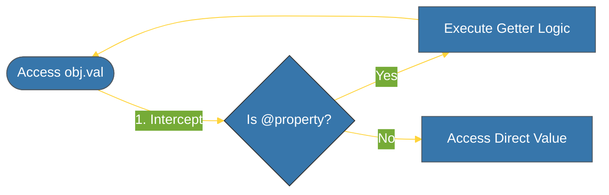

# CH-01: Privacy & Encapsulation (@property) [x] Complete

> **"In Python, we are all consenting adults; we don't need 'private' keywords, just conventions and properties."**

Bab ini membedah bagaimana Python menangani **Enkapsulasi** dan privasi data. Kita akan mempelajari mengapa Python lebih memilih konvensi daripada pembatasan akses yang kaku, serta bagaimana menggunakan **`@property`** untuk mengontrol akses atribut secara elegan.

---

## 🌐 Source Hub (Authority)
- **Primary Source**: [Python Docs - Private Variables](https://docs.python.org/3/tutorial/classes.html#private-variables)
- **Strategic Blueprint**: [RAK-02 Foundation](file:///i:/Workspace/Workspace-Syahputrawork/learning-matrix-blueprint/01-Language-Hubs/Python-Knowledge-Base.md)

---

## 🧠 The Essence (Narrative)
Berbeda dengan Java atau C++, Python tidak memiliki kata kunci `private` atau `protected`. Sebagai gantinya, Python menggunakan konvensi:
1. **`_protected`**: Satu garis bawah adalah sinyal visual: "Sifat ini internal, jangan sentuh dari luar kecuali Anda tahu apa yang Anda lakukan."
2. **`__private`**: Dua garis bawah memicu **Name Mangling**. Python mengubah nama atribut secara internal (misal: `_ClassName__private_attr`) agar tidak tidak sengaja tertimpa oleh subclass.
3. **`@property`**: Cara Pythonic untuk mendefinisikan *Getter* dan *Setter*. Anda bisa mengakses metode seolah-olah mereka adalah atribut biasa.

---

## 🎨 Visual Logic (Property Access)



---

## 🛠️ Implementation: The Property Pattern

```python
class Account:
    def __init__(self, balance):
        self._balance = balance # Protected convention

    @property
    def balance(self):
        """Getter: Add logic before returning data."""
        return f"${self._balance:,.2f}"

    @balance.setter
    def balance(self, value):
        """Setter: Add validation logic."""
        if value < 0:
            raise ValueError("Balance cannot be negative.")
        self._balance = value
```

---

## ⚠️ Pitfalls
- **Name Mangling is NOT Security**: *Name mangling* (`__`) bukanlah fitur keamanan tingkat tinggi. Atribut tersebut tetap bisa diakses jika Anda tahu nama "mangled"-nya. Tujuannya hanyalah untuk menghindari konflik nama dalam pewarisan.
- **Over-encapsulation**: Jangan gunakan `@property` untuk setiap atribut. Gunakan hanya jika Anda perlu melakukan validasi atau transformasi data saat akses/modifikasi.

---
*Back to [BK-03 Encapsulation & Special Methods](../README.md)*
