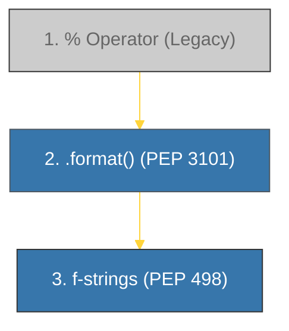

# BK-01: PEP 498 (Literal String Interpolation) [x] Complete

> **"Literal String Interpolation (f-strings) is the most significant improvement to Python's readability since its inception."**

Buku ini membedah **PEP 498**, yang memperkenalkan **f-strings** di Python 3.6. Kita akan menelusuri mengapa metode lama (`%` dan `.format()`) dianggap kurang ideal dan bagaimana f-strings merevolusi cara kita menangani templat teks dengan kecepatan dan keterbacaan maksimal.

---

## 🌐 Source Hub (Authority)
- **Primary Source**: [PEP 498 -- Literal String Interpolation](https://peps.python.org/pep-0498/)
- **Strategic Blueprint**: [RAK-03 Evolution](file:///i:/Workspace/Workspace-Syahputrawork/01-Language-Hubs-Workspace/Python-Knowledge-Base/RAK-03-evolution/README.md)

---

## 🧠 The Essence (Narrative)
Sebelum Python 3.6, penggabungan teks dan variabel seringkali membingungkan. Operator `%` berasal dari gaya bahasa C yang kaku, sementara `.format()` sangat *verbose* (bertele-tele). PEP 498 mengusulkan solusi di tingkat **Literal**: cukup tambahkan awalan `f` pada string, dan Anda bisa memasukkan ekspresi Python apa pun langsung di dalam kurung kurawal `{}`. Hasilnya? Kode yang lebih singkat, lebih cepat (karena dievaluasi saat runtime sebagai bytecode), dan jauh lebih mudah dibaca.

---

## 🎨 Visual Logic (f-string Evolution)



---

## 🛠️ Comparison: Problems -> Solutions

### ❌ The "Verbose" Problem (.format())
```python
name = "Antigravity"
"Hello, my name is {name}".format(name=name)
```

### ✅ The "Literal" Solution (f-string)
```python
name = "Antigravity"
f"Hello, my name is {name}"
```

---

## ⚠️ Pitfalls
- **Python Version**: f-strings hanya tersedia di Python 3.6+. Menggunakannya di lingkungan legacy (seperti server lama dengan Python 3.5) akan menyebabkan `SyntaxError`.
- **Expression Complexity**: Walaupun f-strings mendukung ekspresi kompleks di dalam `{}`, hindari memasukkan logika bisnis yang berat di sana agar kode tetap mudah dibaca. Sebaiknya hitung nilai di variabel luar sebelum dimasukkan ke string.

---
*Back to [SR-01 Syntax Evolution](../README.md)*
