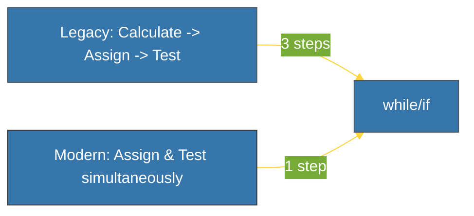

# BK-02: PEP 572 (Assignment Expressions) [x] Complete

> **"The 'Walrus Operator' is about giving a value a name while you're still using it."**

Buku ini membedah **PEP 572**, yang memperkenalkan **Assignment Expressions** (juga dikenal sebagai *Walrus Operator* `:=`) di Python 3.8. Kita akan mempelajari bagaimana fitur ini menyederhanakan alur kontrol dan mengapa ia menjadi salah satu PEP paling kontroversial dalam sejarah Python.

---

## 🌐 Source Hub (Authority)
- **Primary Source**: [PEP 572 -- Assignment Expressions](https://peps.python.org/pep-0572/)
- **Strategic Blueprint**: [RAK-03 Evolution](file:///i:/Workspace/Workspace-Syahputrawork/01-Language-Hubs-Workspace/Python-Knowledge-Base/RAK-03-evolution/README.md)

---

## 🧠 The Essence (Narrative)
Secara historis, Python memisahkan antara **Statement** (perintah `x = 5`) dan **Expression** (perhitungan `x + 5`). Anda tidak bisa menetapkan nilai ke variabel di dalam sebuah kondisi `if`. PEP 572 memecahkan batasan ini dengan operator `:=`. Masalah yang dipecahkan adalah redundansi: Anda seringkali harus menghitung sesuatu, menyimpannya di variabel, dan mengeceknya. Dengan Walrus, Anda melakukan ketiganya sekaligus. Nama "Walrus" berasal dari kemiripan operator `:=` dengan mata dan gading walrus yang menyamping.

---

## 🎨 Visual Logic (Control Flow Evolution)



---

## 🛠️ Comparison: Problems -> Solutions

### ❌ The "Redundant" Problem (Pre-3.8)
```python
data = get_data()
if data:
    process(data)
```

### ✅ The "Walrus" Solution (3.8+)
```python
if (data := get_data()):
    process(data)
```

---

## ⚠️ Pitfalls
- **Python Version**: Walrus operator hanya tersedia di Python 3.8+. Menggunakannya di versi Python 3.6 atau 3.7 akan menyebabkan `SyntaxError`.
- **Readability**: Walrus bisa sangat kuat namun juga berbahaya bagi keterbacaan. Jangan gunakan `:=` secara berlebihan di dalam baris kode yang sudah kompleks. Gunakan hanya jika ia benar-benar menyederhanakan alur, seperti pada `while` loops atau *list comprehensions*.

---
*Back to [SR-01 Syntax Evolution](../README.md)*
