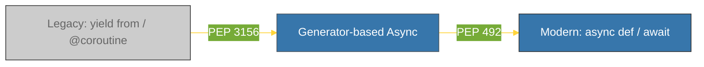

# BK-01: PEP 492 (Coroutines with async and await) [x] Complete

> **"Native coroutines and explicit await syntax make asynchronous code look and behave like synchronous code."**

Buku ini membedah **PEP 492**, yang memperkenalkan kata kunci `async` dan `await` di Python 3.5. Kita akan mempelajari bagaimana Python berevolusi dari penggunaan generator yang membingungkan menjadi sistem coroutine native yang bersih dan tangguh.

---

## 🌐 Source Hub (Authority)
- **Primary Source**: [PEP 492 -- Coroutines with async and await syntax](https://peps.python.org/pep-0492/)
- **Strategic Blueprint**: [RAK-03 Evolution](file:///i:/Workspace/Workspace-Syahputrawork/01-Language-Hubs-Workspace/Python-Knowledge-Base/RAK-03-evolution/README.md)

---

## 🧠 The Essence (Narrative)
Sebelum Python 3.5, pemrograman asinkron mengandalkan generator (`yield from`) dan dekorator `@asyncio.coroutine`. Masalah utamanya adalah **Ambiguitas**: sulit membedakan fungsi generator biasa dengan fungsi asinkron hanya dengan melihat kodenya. PEP 492 mengusulkan solusi di tingkat **Sintaksis Native**. Dengan memperkenalkan `async def` dan `await`, Python memisahkan coroutine secara formal dari generator, memungkinkan pengecekan tipe yang lebih baik, performa yang lebih tinggi, dan keterbacaan yang jauh lebih superior.

---

## 🎨 Visual Logic (Async Evolution Timeline)



---

## 🛠️ Comparison: Problems -> Solutions

### ❌ The "Ambiguous" Problem (Python 3.4)
```python
@asyncio.coroutine
def fetch_data():
    result = yield from some_io_call()
    return result
```

### ✅ The "Native" Solution (Python 3.5+)
```python
async def fetch_data():
    result = await some_io_call()
    return result
```

---

## ⚠️ Pitfalls
- **Python Version**: `async` dan `await` hanya tersedia di Python 3.5+. Jika Anda masih berurusan dengan kode legacy (3.4 ke bawah), Anda harus tetap menggunakan gaya `@coroutine`.
- **Top-Level Await**: Sampai saat ini, Anda tidak bisa menggunakan `await` di tingkat teratas (*top-level*) sebuah file `.py`. `await` harus berada di dalam fungsi yang didefinisikan dengan `async def`. Untuk menjalankan coroutine awal, gunakan `asyncio.run()`.

---
*Back to [SR-02 Async & Concurrency](../README.md)*
