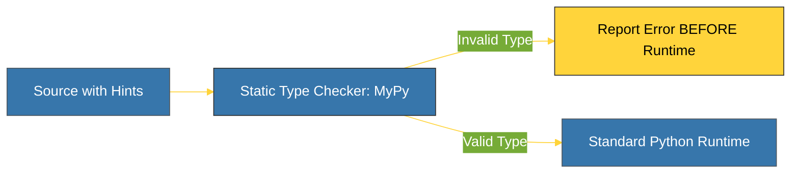

# BK-01: PEP 484 (Type Hints) [x] Complete

> **"Type hints are documentation that can be verified."**

Buku ini membedah **PEP 484**, fondasi dari sistem tipe data statis Python yang diperkenalkan di Python 3.5. Kita akan mempelajari bagaimana proposal ini mengubah Python dari bahasa "tebak-tebakan" menjadi bahasa yang memiliki kontrak tipe yang jelas dan dapat diverifikasi.

---

## 🌐 Source Hub (Authority)
- **Primary Source**: [PEP 484 -- Type Hints](https://peps.python.org/pep-0484/)
- **Strategic Blueprint**: [RAK-03 Evolution](file:///i:/Workspace/Workspace-Syahputrawork/01-Language-Hubs-Workspace/Python-Knowledge-Base/RAK-03-evolution/README.md)

---

## 🧠 The Essence (Narrative)
Secara historis, Python sangat bergantung pada *Duck Typing* ("Jika ia berjalan seperti bebek, maka ia adalah bebek"). Masalah muncul pada basis kode besar: pengembang sering lupa apa tipe data yang diharapkan oleh sebuah fungsi, menyebabkan *Runtime Errors* yang sulit dilacak. PEP 484 mengusulkan solusi di tingkat **Meta-data**. Dengan menambahkan anotasi `name: str`, Python tidak memaksa tipe tersebut saat dijalankan, tetapi memungkinkan alat eksternal seperti **MyPy** untuk memvalidasi logika Anda sebelum kode dijalankan. Ini adalah langkah pertama Python menuju keamanan tipe tingkat industri.

---

## 🎨 Visual Logic (Type Analysis Pipeline)



---

## 🛠️ Comparison: Problems -> Solutions

### ❌ The "Mystery" Problem (Legacy)
```python
def greeting(name):
    # Apa itu name? String? Object? List?
    return "Hello " + name
```

### ✅ The "Annotated" Solution (3.5+)
```python
def greeting(name: str) -> str:
    # Jelas: menerima string, mengembalikan string
    return "Hello " + name
```

---

## ⚠️ Pitfalls
- **No Runtime Enforcement**: PEP 484 secara eksplisit menyatakan bahwa Python tetap merupakan bahasa dinamis. Interpreter Python akan mengabaikan petunjuk tipe saat dijalankan. Jika Anda memasukkan integer ke fungsi yang mengharapkan string, Python tidak akan berhenti (kecuali Anda menggunakan alat pengecek eksternal).
- **Complexity Overhead**: Jangan mencoba memberikan tipe pada segalanya di awal. Mulailah dari fungsi yang paling krusial. Memberikan tipe pada setiap variabel lokal terkadang bisa membuat kode lebih sulit dibaca tanpa memberikan keuntungan validasi yang signifikan.

---
*Back to [SR-03 Type System Evolution](../README.md)*
