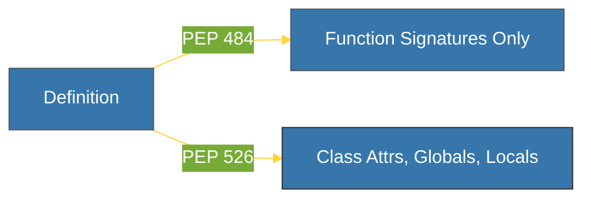

# BK-02: PEP 526 (Syntax for Variable Annotations) [x] Complete

> **"Variable annotations bring type safety to every corner of your code, not just function headers."**

Buku ini membedah **PEP 526**, yang memperkenalkan **Variable Annotations** di Python 3.6. Kita akan mempelajari bagaimana proposal ini melengkapi sistem petunjuk tipe dengan mengizinkan pemberian tipe pada variabel kelas, variabel global, dan variabel lokal secara eksplisit.

---

## 🌐 Source Hub (Authority)
- **Primary Source**: [PEP 526 -- Syntax for Variable Annotations](https://peps.python.org/pep-0526/)
- **Strategic Blueprint**: [RAK-03 Evolution](file:///i:/Workspace/Workspace-Syahputrawork/01-Language-Hubs-Workspace/Python-Knowledge-Base/RAK-03-evolution/README.md)

---

## 🧠 The Essence (Narrative)
Sebelumnya, Python hanya mendukung anotasi pada **Signature Fungsi** (Parameter dan Return). Masalah muncul saat kita mendefinisikan atribut kelas: sulit bagi MyPy atau IDE untuk mengetahui tipe data atribut tersebut jika tidak langsung diinisialisasi dalam `__init__`. PEP 526 mengusulkan solusi di tingkat **Deklarasi**. Dengan sintaksis `var: type = value`, Anda dapat dengan jelas mendefinisikan apa tipe data sebuah variabel sejak awal, bahkan tanpa memberikan nilai awal sama sekali (sebagai janji bahwa tipe tersebut akan diarsir nantinya).

---

## 🎨 Visual Logic (Variable Annotation Pattern)



---

## 🛠️ Comparison: Problems -> Solutions

### ❌ The "Ambiguous" Problem (Pre-3.6)
```python
class User:
    # Bagaimana MyPy tahu tipe atribut ini?
    stats = []
```

### ✅ The "Annotated" Solution (3.6+)
```python
class User:
    # Jelas: stats adalah list dari integer
    stats: list[int] = []
```

---

## ⚠️ Pitfalls
- **No Namespace Change**: Anotasi variabel tidak mengubah cara variabel tersebut disimpan atau didapatkan dalam namespace Python. Mereka tetap disimpan dalam kamus `__annotations__` namun perilaku runtime variabel tersebut tetap sama.
- **Initialization Trap**: Memberikan tipe `x: int` **TIDAK** berarti variabel `x` sudah dibuat. Jika Anda mencoba mengakses `x` sebelum memberikan nilai (`x = 10`), Python tetap akan melemparkan `NameError`. Anotasi tanpa inisialisasi hanyalah deklarasi untuk alat bantu static checking.

---
*Back to [SR-03 Type System Evolution](../README.md)*
