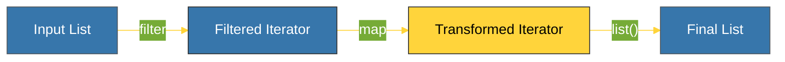

# BK-01: Transformation (map, filter, lambda) [x] Complete

> **"Functional transformation is not about changing data; it's about creating new perspectives of data efficiently."**

Buku ini membedah trio maut transformasi data di Python: **`map()`**, **`filter()`**, dan **`lambda`**. Kita akan mempelajari bagaimana fungsi-fungsi bawaan ini bekerja di level rendah untuk memberikan performa iterasi yang lebih cepat daripada loop konvensional.

---

## 🌐 Source Hub (Authority)
- **Primary Source**: [Python Docs - Built-in Functions](https://docs.python.org/3/library/functions.html)
- **Strategic Blueprint**: [RAK-05 Standard Library](file:///i:/Workspace/Workspace-Syahputrawork/01-Language-Hubs-Workspace/Python-Knowledge-Base/RAK-05-standard-library/README.md)

---

## 🧠 The Essence (Narrative)
Python menyediakan fungsi tingkat tinggi (*Higher-order functions*) untuk memproses koleksi data tanpa harus menulis loop `for` yang repetitif. 
1.  **`map(func, iterable)`**: Menerapkan fungsi ke setiap elemen.
2.  **`filter(func, iterable)`**: Menyaring elemen berdasarkan kriteria kebenaran.
Keunggulan utamanya adalah **Lazy Evaluation**. Hasil dari `map` dan `filter` bukanlah list, melainkan **Iterator**. Data hanya diproses saat benar-benar diminta, menjadikannya sangat hemat memori untuk dataset besar.

---

## 🎨 Visual Logic (Transformation Pipeline)



---

## 🛠️ Comparison: Syntax vs Efficiency
```python
# Cara Konvensional (Loop)
result = []
for x in data:
    if x > 10:
        result.append(x * 2)

# Cara Fungsional (Modern)
result = map(lambda x: x * 2, filter(lambda x: x > 10, data))
```

---

## ⚠️ Pitfalls
- **Readability Trap**: Jangan menggunakan `map` dan `filter` jika logika transformasinya sangat kompleks. Seringkali **List Comprehension** jauh lebih mudah dibaca oleh manusia.
- **Single-use Iterators**: Ingat bahwa hasil `map` dan `filter` adalah iterator. Setelah Anda mengubahnya menjadi list atau melakukan loop padanya, iterator tersebut akan "habis".
- **Lambda Limitations**: Fungsi `lambda` hanya bisa berisi satu ekspresi. Jika Anda butuh logika multi-baris, gunakan fungsi standar (`def`).

---
*Back to [SR-01 Builtins](../README.md)*
