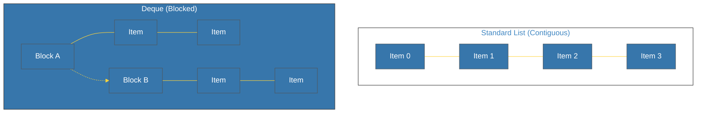

# BK-01: Counters & Deques (Frekuensi & Antrean) [x] Complete

> **"A list is not always the best tool for the job. Know your collections, know your performance."**

Buku ini membedah dua struktur data dari modul `collections` yang dirancang untuk performa tinggi: **`Counter`** (untuk analisis frekuensi) dan **`deque`** (untuk operasi antrean yang sangat cepat). Kita akan mempelajari mengapa `list` standar terkadang menjadi penghambat performa dalam skenario tertentu.

---

## 🌐 Source Hub (Authority)
- **Primary Source**: [Python Docs - collections (Container datatypes)](https://docs.python.org/3/library/collections.html)
- **Strategic Blueprint**: [RAK-05 Standard Library](file:///i:/Workspace/Workspace-Syahputrawork/01-Language-Hubs-Workspace/Python-Knowledge-Base/RAK-05-standard-library/README.md)

---

## 🧠 The Essence (Narrative)
Python `list` dioptimalkan untuk akses acak (*Random Access*). Namun, jika Anda sering menambah atau menghapus data dari **awal** list, Python harus menggeser seluruh elemen, menjadikannya operasi $O(n)$. **`deque`** (Double-Ended Queue) memecahkan ini dengan struktur *linked-list of blocks*, memungkinkan penambahan/penghapusan dari kedua ujung dalam waktu $O(1)$. Sementara itu, **`Counter`** menghapus kebutuhan penulisan loop repetitif untuk menghitung jumlah kemunculan elemen, memberikan Anda alat analisis instan untuk dataset apa pun.

---

## 🎨 Visual Logic (List vs Deque Memory Layout)



---

## 🛠️ Implementation: Frequency & Windowing
```python
from collections import Counter, deque

# 1. Counter: Frekuensi Instan
data = "python mastery is powerful"
freq = Counter(data)
print(freq.most_common(3)) # Top 3 karakter

# 2. Deque: Sliding Window (Antrean Tetap)
history = deque(maxlen=3)
for x in range(10):
    history.append(x)
    print(list(history)) # Selalu menyimpan 3 elemen terakhir
```

---

## ⚠️ Pitfalls
- **The Middle Insertion**: Meskipun `deque` sangat cepat di kedua ujung, ia tetap lambat ($O(n)$) untuk penyisipan atau penghapusan di **tengah** koleksi. Jika Anda butuh banyak penyisipan di tengah, gunakan struktur data lain.
- **Counter Dictionary Power**: Ingat bahwa `Counter` adalah subclass dari `dict`. Anda bisa menggunakan metode kamus standar padanya, namun ia akan mengembalikan `0` alih-alih melempar `KeyError` jika kunci tidak ditemukan.
- **Memory Overhead**: `deque` memiliki overhead memori sedikit lebih besar daripada `list` karena struktur blok internalnya. Gunakan hanya jika Anda benar-benar melakukan banyak operasi `popleft` atau `appendleft`.

---
*Back to [SR-03 Collections](../README.md)*
