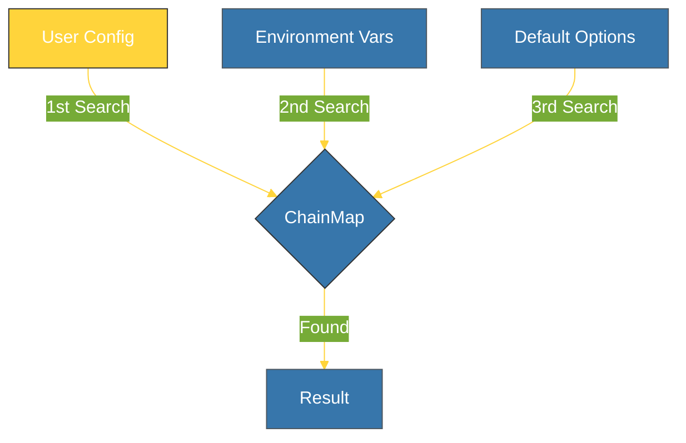

# BK-02: Advanced Dicts (Kamus Tingkat Lanjut) [x] Complete

> **"A dict is the heart of Python; advanced dicts are its sophisticated valves."**

Buku ini membedah dua variasi kamus tingkat lanjut dari modul `collections`: **`defaultdict`** (untuk pengelompokan data tanpa `KeyError`) dan **`ChainMap`** (untuk penggabungan kamus secara visual tanpa duplikasi data). Kita akan mempelajari bagaimana alat ini menyederhanakan logika manipulasi kamus yang kompleks.

---

## 🌐 Source Hub (Authority)
- **Primary Source**: [Python Docs - collections (Container datatypes)](https://docs.python.org/3/library/collections.html)
- **Strategic Blueprint**: [RAK-05 Standard Library](file:///i:/Workspace/Workspace-Syahputrawork/01-Language-Hubs-Workspace/Python-Knowledge-Base/RAK-05-standard-library/README.md)

---

## 🧠 The Essence (Narrative)
Kamus standar (`dict`) akan melempar `KeyError` jika Anda mencoba mengakses kunci yang belum ada. Hal ini seringkali memaksanya untuk menggunakan metode `.get()` atau `if key in d:`. **`defaultdict`** memecahkan ini dengan menyediakan fungsi pabrik (*factory function*) yang secara otomatis menciptakan nilai baru saat kunci tidak ditemukan. Sementara itu, **`ChainMap`** memungkinkan Anda untuk "menumpuk" beberapa kamus dan mencarinya sebagai satu kesatuan. Ini sangat ideal untuk sistem konfigurasi di mana pengaturan pengguna menimpa pengaturan default.

---

## 🎨 Visual Logic (ChainMap Layered Lookup)



---

## 🛠️ Implementation: Grouping & Layers
```python
from collections import defaultdict, ChainMap

# 1. defaultdict: Pengelompokan Instan
groups = defaultdict(list)
data = [("fruits", "apple"), ("fruits", "banana"), ("veggies", "carrot")]

for cat, item in data:
    groups[cat].append(item) # Tanpa KeyError!

# 2. ChainMap: Konfigurasi Berlapis
defaults = {"theme": "light", "user": "guest"}
user_settings = {"theme": "dark"}
config = ChainMap(user_settings, defaults)

print(config["theme"]) # Result: 'dark' (User overrides default)
print(config["user"])  # Result: 'guest' (Fallback to default)
```

---

## ⚠️ Pitfalls
- **Implicit Key Creation**: Hati-hati saat menggunakan `defaultdict` dalam sistem pengecekan. Hanya dengan **mengakses** sebuah kunci (misal: `print(my_defaultdict['missing'])`), kunci tersebut akan **otomatis diciptakan** dalam kamus. Gunakan `in` jika Anda hanya ingin mengecek keberadaan kunci tanpa menciptakannya.
- **ChainMap Updates**: Operasi penulisan atau penghapusan (`d[k] = v` atau `del d[k]`) pada `ChainMap` hanya akan mempengaruhi **kamus pertama** dalam tumpukan. Ini bisa membingungkan jika Anda mengharapkan pemutakhiran di seluruh lapisan.
- **Performance**: `ChainMap` tidak menyalin data dari kamus-kamus aslinya. Ia hanya menyimpan referensi. Ini sangat hemat memori namun tetap memerlukan waktu pencarian linier $O(n)$ berdasarkan jumlah kamus yang ditumpuk.

---
*Back to [SR-03 Collections](../README.md)*
