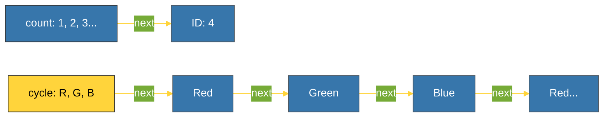

# BK-01: Infinite Iterables (count, cycle, repeat) [x] Complete

> **"In the world of itertools, infinity is just a starting point."**

Buku ini membedah **Infinite Iterators**, alat dari modul `itertools` yang memungkinkan Anda menghasilkan aliran data tanpa batas dengan konsumsi memori yang hampir nol. Kita akan mempelajari bagaimana mengelola "keabadian" ini secara aman di dalam aplikasi Python Anda.

---

## 🌐 Source Hub (Authority)
- **Primary Source**: [Python Docs - itertools (Functions creating iterators for efficient looping)](https://docs.python.org/3/library/itertools.html)
- **Strategic Blueprint**: [RAK-05 Standard Library](file:///i:/Workspace/Workspace-Syahputrawork/01-Language-Hubs-Workspace/Python-Knowledge-Base/RAK-05-standard-library/README.md)

---

## 🧠 The Essence (Narrative)
Kadang-kadang kita butuh angka yang terus bertambah (misal: ID baris) atau pola yang berulang selamanya tanpa tahu kapan harus berhenti. Menggunakan list untuk ini akan menghancurkan memori Anda. **`itertools`** menyediakan tiga iterator kunci:
1.  **`count(start, step)`**: Menghasilkan deret angka tak terhingga.
2.  **`cycle(iterable)`**: Mengulangi elemen dari sebuah koleksi selamanya (seperti komidi putar).
3.  **`repeat(object, times)`**: Mengulangi objek yang sama berkali-kali (atau selamanya).
Semuanya bekerja secara **Lazy**, artinya angka berikutnya hanya diciptakan saat Anda memintanya.

---

## 🎨 Visual Logic (Infinite Stream Mechanics)



---

## 🛠️ Implementation: Dynamic ID & Round Robin
```python
import itertools

# 1. count: Generator ID Otomatis
counter = itertools.count(start=100, step=10)
print(next(counter)) # 100
print(next(counter)) # 110

# 2. cycle: Penjadwalan Round-Robin
players = ["P1", "P2", "P3"]
turns = itertools.cycle(players)
for _ in range(5):
    print(f"Turn for: {next(turns)}")
```

---

## ⚠️ Pitfalls
- **The List Trap**: **JANGAN PERNAH** merubah infinite iterator menjadi list (`list(count())`). Ini akan menyebabkan `MemoryError` seketika karena Python mencoba menyimpan angka tak terhingga ke dalam RAM.
- **Missing Break Condition**: Saat melakukan loop pada infinite iterator, pastikan ada kondisi `break` atau gunakan `islice` untuk membatasi jumlah iterasi.
- **State in Cycle**: `cycle()` menyimpan salinan elemen internal. Jika iterable aslinya sangat besar, pemanggilan cycle pertama kali akan memakan memori untuk menduplikasi elemen tersebut sebelum mulai mengulang.

---
*Back to [SR-04 Itertools](../README.md)*
