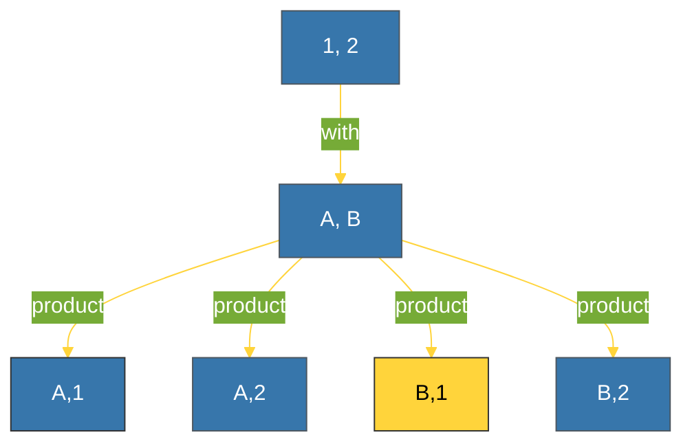

# BK-02: Combinatorics (product, permutations, combinations) [x] Complete

> **"Combinatorics is the science of all possible outcomes. Itertools is the engine that generates them without breaking a sweat."**

Buku ini membedah **Combinatoric Iterators**, alat dari modul `itertools` yang memungkinkan Anda menghasilkan semua kemungkinan kombinasi, permutasi, dan perkalian Cartesian tanpa harus menulis loop bersarang (*nested loops*) yang rumit dan lambat.

---

## 🌐 Source Hub (Authority)
- **Primary Source**: [Python Docs - itertools (Functions creating iterators for efficient looping)](https://docs.python.org/3/library/itertools.html)
- **Strategic Blueprint**: [RAK-05 Standard Library](file:///i:/Workspace/Workspace-Syahputrawork/01-Language-Hubs-Workspace/Python-Knowledge-Base/RAK-05-standard-library/README.md)

---

## 🧠 The Essence (Narrative)
Seringkali kita butuh menguji semua kemungkinan pasangan data (misal: Warna X Ukuran). Menulis `for` di dalam `for` di dalam `for` adalah resep kekacauan kode (*Pyramid of Doom*). **`itertools`** menawarkan solusi matematis:
1.  **`product(*iterables, repeat=1)`**: Menghasilkan perkalian Cartesian (semua pasangan). Pengganti *nested loops*.
2.  **`permutations(iterable, r)`**: Menghasilkan semua urutan unik di mana urutan elemen diperhitungkan.
3.  **`combinations(iterable, r)`**: Menghasilkan semua kelompok unik di mana urutan **TIDAK** diperhitungkan.

---

## 🎨 Visual Logic (Cartesian Product Mapping)



---

## 🛠️ Implementation: Eliminating Nested Loops
```python
import itertools

# 1. Product: Pembersihan Grid
colors = ["Red", "Blue"]
sizes = ["S", "M", "L"]

# Clean & Efficient
for color, size in itertools.product(colors, sizes):
    print(f"Product: {color} {size}")

# 2. Combinations: Mencari Pasangan (N-choose-K)
team = ["Dev1", "Dev2", "Dev3"]
for pair in itertools.combinations(team, 2):
    print(f"Peer Review: {pair}")
```

---

## ⚠️ Pitfalls
- **Combinatorial Explosion**: Hati-hati dengan jumlah elemen masukan. Combinations dari 100 elemen diambil 10 besar akan menghasilkan **17 triliun lebih** hasil. Python tidak akan kehabisan memori (karena iterator), namun program Anda akan berjalan selamanya.
- **Repeat vs Product**: Gunakan argumen `repeat` dalam `product` untuk melakukan perkalian mandiri (misal: `product([0, 1], repeat=8)` untuk semua kemungkinan byte).
- **Order Matters**: Pastikan Anda tahu beda antara Permutations (AB != BA) dan Combinations (AB == BA). Memilih fungsi yang salah akan memberikan hasil yang redundan atau kurang.

---
*Back to [SR-04 Itertools](../README.md)*
