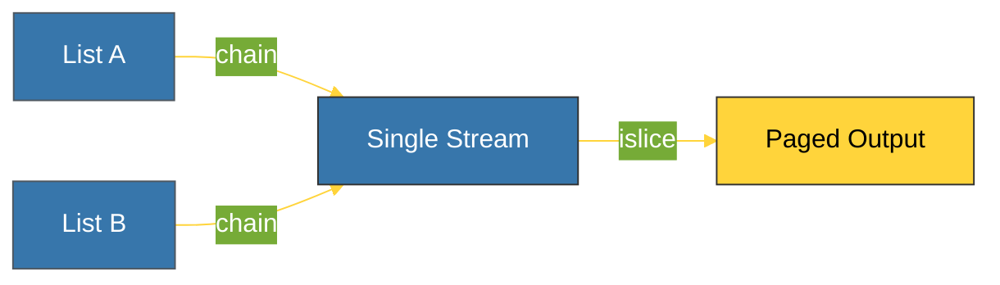

# BK-03: Pipeline Tools (chain, islice, groupby) [x] Complete

> **"A data pipeline is only as fast as its slowest iterator. Itertools ensures your pipes stay clean."**

Buku ini membedah **Pipeline Iterators**, alat dari modul `itertools` yang memungkinkan Anda menyambung, memotong, dan mengelompokkan aliran data secara efisien. Kita akan mempelajari bagaimana melakukan operasi kompleks pada koleksi data besar tanpa harus memuat seluruh data ke dalam memori.

---

## 🌐 Source Hub (Authority)
- **Primary Source**: [Python Docs - itertools (Functions creating iterators for efficient looping)](https://docs.python.org/3/library/itertools.html)
- **Strategic Blueprint**: [RAK-05 Standard Library](file:///i:/Workspace/Workspace-Syahputrawork/01-Language-Hubs-Workspace/Python-Knowledge-Base/RAK-05-standard-library/README.md)

---

## 🧠 The Essence (Narrative)
Mengoperasikan data masif membutuhkan strategi "aliran" (*streaming*). 
1.  **`chain(*iterables)`**: Menyambung beberapa koleksi (misal: List A + List B) menjadi satu iterator lancar tanpa membuat list baru di memori.
2.  **`islice(iterable, stop)`**: Memungkinkan pemotongan (*slicing*) pada iterator. Berbeda dengan `list[0:10]`, `islice` tidak menyalin data, ia hanya mengonsumsi item yang diperlukan.
3.  **`groupby(iterable, key=None)`**: Mengelompokkan elemen berurutan yang memiliki kunci yang sama. Alat paling kuat untuk analisis data agregat.

---

## 🎨 Visual Logic (Data Slicing & Chaining Map)



---

## 🛠️ Implementation: High-speed Chaining & Paging
```python
import itertools

# 1. chain: Menyambung Tanpa Copy
a = range(1_000_000)
b = range(1_000_000)
combined = itertools.chain(a, b) # Instant! (0 MB memory)

# 2. islice: Paging Data Masif
first_ten = itertools.islice(combined, 10)
print(list(first_ten))

# 3. groupby: Agregasi (Wajib SORTIR duluan!)
data = [("A", 10), ("A", 20), ("B", 5)]
for key, group in itertools.groupby(data, lambda x: x[0]):
    print(f"Category {key}: {len(list(group))} items")
```

---

## ⚠️ Pitfalls
- **The Groupby Requirement**: **PENTING!** `groupby()` hanya bekerja pada data yang **sudah urut** (*sorted*) berdasarkan kunci pengelompokannya. Jika data tidak urut, `groupby` akan menghasilkan banyak kelompok kecil yang terpisah untuk kunci yang sama.
- **Chain vs List Add**: Menggunakan `a + b` pada list membuat list baru ke-3 di memori. Menggunakan `chain(a, b)` hanya membuat satu pointer baru. Untuk data besar, gunakan `chain`.
- **Exhausting islice**: Ingat bahwa `islice` mengonsumsi iterator aslinya. Jika Anda memotong 10 data pertama, iterator asli tersebut kini sudah bergeser 10 posisi ke depan.

---
*Back to [SR-04 Itertools](../README.md)*
