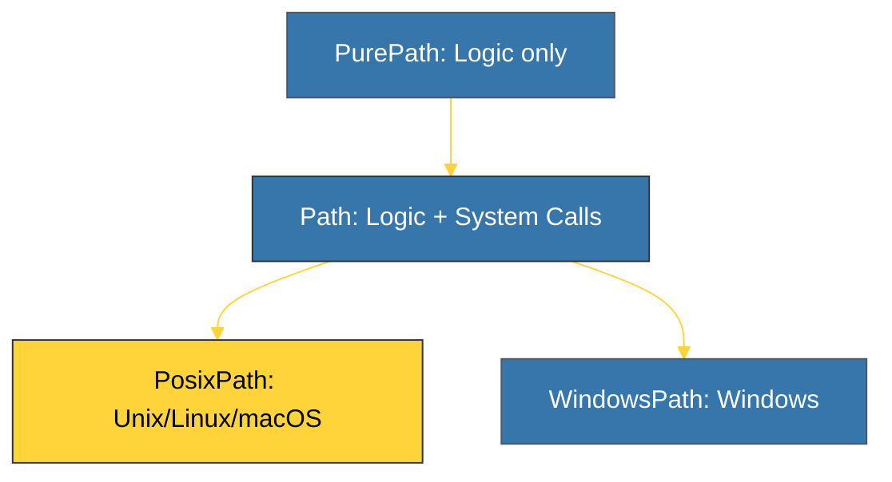

# BK-01: Pathlib Objects (Object-Oriented Paths) [x] Complete

> **"Paths are not just strings; they are first-class citizens in your application's architecture."**

Buku ini membedah **`pathlib`**, standar modern Python untuk manipulasi jalur file (*file paths*). Kita akan mempelajari mengapa Anda harus meninggalkan `os.path` yang berbasis string dan beralih ke objek `Path` yang lebih aman, konsisten secara lintas-platform, dan memiliki sintaksis yang sangat elegan.

---

## 🌐 Source Hub (Authority)
- **Primary Source**: [Python Docs - pathlib (Object-oriented filesystem paths)](https://docs.python.org/3/library/pathlib.html)
- **Strategic Blueprint**: [RAK-05 Standard Library](file:///i:/Workspace/Workspace-Syahputrawork/01-Language-Hubs-Workspace/Python-Knowledge-Base/RAK-05-standard-library/README.md)

---

## 🧠 The Essence (Narrative)
Secara historis, manipulasi file di Python dilakukan menggunakan modul `os` dan `os.path`. Masalahnya: jalur file diperlakukan sebagai string murni, yang rawan kesalahan (seperti lupa slash `/` vs `\`) dan sulit dibaca. **`pathlib`** mengubah paradigma ini. Sebuah path adalah objek yang memiliki metode sendiri. Anda bisa menyambung folder menggunakan operator `/`, mencari file dengan `.glob()`, dan membaca seluruh isi file hanya dengan satu metode `.read_text()`. Ini adalah cara Pythonic yang sesungguhnya.

---

## 🎨 Visual Logic (Path Object Hierarchy)



---

## 🛠️ Implementation: The Power of `/`
```python
from pathlib import Path

# 1. Joining Paths (Elegant & Cross-platform)
base_dir = Path.cwd()
data_file = base_dir / "data" / "users.json"

# 2. Instant Check & Read
if data_file.exists():
    content = data_file.read_text(encoding="utf-8")

# 3. Recursive Search (Power of rglob)
for py_file in base_dir.rglob("*.py"):
    print(f"Found Python source: {py_file.name}")
```

---

## ⚠️ Pitfalls
- **Performance of rglob**: `Path.rglob()` sangat sakti, namun jika dijalankan pada akar direktori yang memiliki jutaan file, ia akan memakan waktu lama. Gunakan secara bijak pada sub-folder yang spesifik.
- **PurePath vs Path**: `PurePath` tidak melakukan pemanggilan sistem (IO). Ia hanya menghitung manipulasi string path secara logis. Jika Anda ingin mengecek keberadaan file fisik, Anda **wajib** menggunakan `Path`.
- **String Conversion**: Meskipun banyak library modern sudah mendukung objek `Path`, Anda terkadang tetap perlu mengubahnya kembali ke string menggunakan `str(path_obj)` saat berinteraksi dengan library C tingkat rendah atau API legacy.

---
*Back to [SR-05 I/O & Path](../README.md)*
