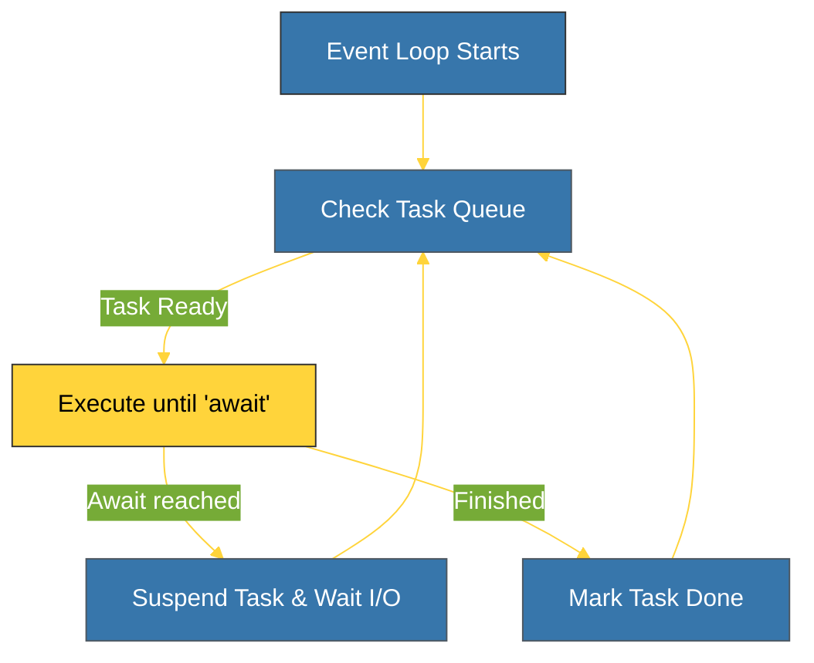

# BK-01: Asyncio Internals (Event Loop & Tasks) [x] Complete

> **"Asyncio is not about speed; it's about waiting efficiently."**

Buku ini membedah **`asyncio`**, standar library Python untuk menulis kode konkuren menggunakan sintaksis `async`/`await`. Kita akan mempelajari bagaimana **Event Loop** mengelola ribuan koneksi secara bersamaan di dalam satu thread tunggal tanpa membebani memori CPU.

---

## 🌐 Source Hub (Authority)
- **Primary Source**: [Python Docs - asyncio (Asynchronous I/O)](https://docs.python.org/3/library/asyncio.html)
- **Strategic Blueprint**: [RAK-05 Standard Library](file:///i:/Workspace/Workspace-Syahputrawork/01-Language-Hubs-Workspace/Python-Knowledge-Base/RAK-05-standard-library/README.md)

---

## 🧠 The Essence (Narrative)
Secara tradisional, konkurensi dilakukan melalui Threading. Namun, thread memakan memori besar dan sulit dikelola karena *Race Conditions*. **`asyncio`** menggunakan paradigma **Cooperative Multitasking**. Program berjalan di satu thread. Saat sebuah tugas harus menunggu (misal: menunggu respons API), ia secara sukarela melepaskan kendali kembali ke **Event Loop**. Event Loop kemudian menjalankan tugas lain yang sudah siap. Ini menjadikan `asyncio` pilihan utama untuk aplikasi *Network-heavy* atau *I/O-bound*.

---

## 🎨 Visual Logic (Asyncio Event Loop Cycle)



---

## 🛠️ Implementation: High-Concurrency Gathering
```python
import asyncio

async def fetch_data(id):
    print(f"   [START] Task {id}...")
    await asyncio.sleep(1) # Simulate I/O wait
    print(f"   [DONE] Task {id}!")
    return f"Result {id}"

async def main():
    # Run multiple tasks concurrently
    results = await asyncio.gather(
        fetch_data(1),
        fetch_data(2),
        fetch_data(3)
    )
    print(f"Final: {results}")

# Entry point (Python 3.7+)
# asyncio.run(main())
```

---

## ⚠️ Pitfalls
- **The Golden Rule**: **JANGAN PERNAH memblokir Event Loop.** Penggunaan fungsi sinkron yang memakan waktu lama (seperti `time.sleep()` atau query DB sinkron) akan menghentikan **SELURUH** aplikasi asinkron Anda. Gunakan versi `async` atau jalankan di thread terpisah.
- **Forgetting Await**: Menjalankan fungsi `async` tanpa `await` tidak akan mengeksekusi logika fungsi tersebut; ia hanya akan mengembalikan objek *coroutine* yang belum dijalankan.
- **CPU-bound Tasks**: `asyncio` tidak dirancang untuk komputasi berat (seperti enkripsi atau pemrosesan citra). Untuk itu, gunakan `multiprocessing`.

---
*Back to [SR-06 Concurrency](../README.md)*
