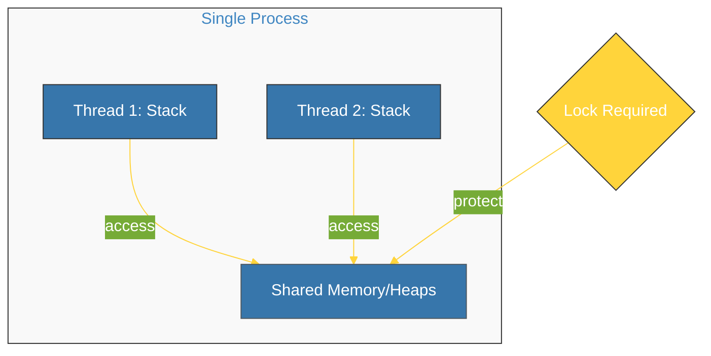

# BK-02: Low-Level Threading (Threads & Queues) [x] Complete

> **"Threading is the power to multitask, but with great power comes the great responsibility of synchronization."**

Buku ini membedah **`threading`**, standar library Python untuk melakukan eksekusi paralel berbasis thread sistem operasi. Kita akan mempelajari bagaimana menangani sumber daya bersama secara aman menggunakan **Lock**, serta cara berkomunikasi antar-thread menggunakan antrean (**Queue**) yang thread-safe.

---

## 🌐 Source Hub (Authority)
- **Primary Source**: [Python Docs - threading (Thread-based parallelism)](https://docs.python.org/3/library/threading.html)
- **Strategic Blueprint**: [RAK-05 Standard Library](file:///i:/Workspace/Workspace-Syahputrawork/01-Language-Hubs-Workspace/Python-Knowledge-Base/RAK-05-standard-library/README.md)

---

## 🧠 The Essence (Narrative)
Berbeda dengan `asyncio` yang bersifat kooperatif di satu thread, **Threading** menggunakan thread OS yang berjalan secara paralel. Masalah utamanya: semua thread berbagi memori yang sama. Jika dua thread mencoba mengubah variabel yang sama secara bersamaan, akan terjadi **Race Condition** yang fatal. Oleh karena itu, kita memerlukan mekanisme sinkronisasi seperti **Lock** (Gembok). Selain itu, untuk komunikasi data yang aman, Python menyediakan modul **`queue`** yang secara internal sudah menangani penguncian, sehingga Anda tidak perlu khawatir tentang integritas data saat mengirim pesan antar-thread.

---

## 🎨 Visual Logic (Shared Memory Architecture)



---

## 🛠️ Implementation: Thread-Safe Counters
```python
import threading
from queue import Queue

# 1. Synchronization with Lock
counter = 0
lock = threading.Lock()

def worker():
    global counter
    with lock: # Critical Section
        counter += 1

# 2. Communication with Queue (Thread-Safe)
q = Queue()
q.put("Work Item") # Producer
item = q.get()     # Consumer
```

---

## ⚠️ Pitfalls
- **The GIL Limit**: Karena adanya **Global Interpreter Lock** (GIL), hanya satu thread yang bisa mengeksekusi bytecode Python pada satu waktu. Threading sangat bagus untuk I/O-bound (menunggu jaringan), namun **TIDAK** memberikan percepatan untuk CPU-bound (perhitungan berat). Untuk CPU-bound, gunakan `multiprocessing`.
- **Deadlocks**: Terjadi saat Thread A menunggu Lock B, dan Thread B menunggu Lock A. Keduanya akan berhenti selamanya. Selalu gunakan urutan penguncian yang konsisten atau `with` statement.
- **Race Condition**: Selalu berasumsi bahwa operasi global (seperti `counter += 1`) **TIDAK** atomik. Tanpa Lock, hasil akhirnya bisa salah karena interupsi thread di tengah operasi penambahan.

---
*Back to [SR-06 Concurrency](../README.md)*
