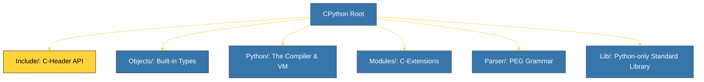

# BK-01: Labirinto CPython (Folder Hierarchy) [x] Complete

> **"To find the soul of the serpent, you must first navigate its physical body."**

Buku ini membedah **Anatomi Repositori CPython**, sebuah labirin berisi lebih dari 800.000 baris kode C dan Python. Kita akan memetakan folder-folder utama yang menjadi fondasi bagaimana Python dibangun, dikompilasi, dan dieksekusi.

---

## 🌐 Source Hub (Authority)
- **Primary Source**: [CPython GitHub Repository](https://github.com/python/cpython)
- **Strategic Blueprint**: [RAK-06 Interpreters](file:///i:/Workspace/Workspace-Syahputrawork/01-Language-Hubs-Workspace/Python-Knowledge-Base/RAK-06-interpreters/README.md)

---

## 🧠 The Essence (Narrative)
CPython bukan sekadar satu program besar, melainkan ekosistem komponen yang saling terhubung. Saat Anda mengunduh kode sumbernya, Anda akan melihat ribuan file. Tanpa peta jalan, sangat mudah untuk tersesat. Intisari dari bab ini adalah memahami 4 "Pilar Fisik" CPython:
1.  **`Include/`**: Header files (`.h`) yang mendefinisikan seluruh C-API.
2.  **`Objects/`**: Implementasi tipe data inti (List, Dict, String) dalam C.
3.  **`Python/`**: Jantung mesin (The Engine), berisi compiler dan eval loop.
4.  **`Modules/`**: Implementasi library standar yang ditulis dalam C untuk performa tinggi (misal: `math`, `hashlib`).

---

## 🎨 Visual Logic (CPython Source Map)

---

## 🛠️ Step-by-Step Anatomy
- **`Include/`**: Tempat `object.h` berada. Jika Anda ingin melihat definisi `PyObject`, di sinilah tempatnya.
- **`Objects/`**: Berisi `longobject.c` (Integer), `listobject.c` (List), dll. Di sini logika manipulasi data tingkat rendah ditulis.
- **`Python/`**: Berisi `ceval.c`, file paling penting yang berisi loop utama eksekusi bytecode.
- **`Parser/`**: Berisi definisi tata bahasa (`python.gram`) dan kode generator parser.

---

## ⚠️ Pitfalls
- **The "Python-only" Illusion**: Jangan berasumsi bahwa seluruh Python ditulis dalam Python. Library standar yang ada di folder `Lib/` hanyalah sebagian kecil. Performa kritis Python ada di folder `Modules/` dan `Objects/` yang ditulis dalam C.
- **Version Drift**: Struktur folder CPython bersifat stabil namun berevolusi. Pastikan Anda memeriksa branch yang benar (misal: `main` untuk versi terbaru atau tags untuk versi spesifik).
- **Macro Heavy**: Kode sumber Python sangat bergantung pada Makro C. Membacanya membutuhkan pemahaman tentang preprocessor C agar tidak bingung dengan sintaks yang tidak standar.

---
*Back to [SR-01 Source Anatomy](../README.md)*
