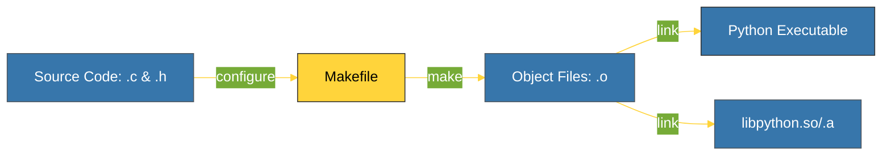

# BK-02: Build System (configure, make, libpython) [x] Complete

> **"A compiler is just a tool; the build system is the architect that directs it."**

Buku ini membedah **Pipa Pembangunan CPython**, proses transformasi ratusan file kode sumber C menjadi satu executable `python` yang kita gunakan sehari-hari. Kita akan mempelajari bagaimana sistem Autotools mengelola konfigurasi dan kompilasi secara lintas-platform.

---

## 🌐 Source Hub (Authority)
- **Primary Source**: [CPython Developer Guide - Setup & Building](https://devguide.python.org/getting-started/setup-building/index.html)
- **Strategic Blueprint**: [RAK-06 Interpreters](file:///i:/Workspace/Workspace-Syahputrawork/01-Language-Hubs-Workspace/Python-Knowledge-Base/RAK-06-interpreters/README.md)

---

## 🧠 The Essence (Narrative)
Membangun Python dari sumbernya bukan sekadar menjalankan satu perintah. Ada tiga tahap kritis:
1.  **`./configure`**: Skrip ini mendeteksi lingkungan sistem Anda (OS, Compiler, Library). Ia menghasilkan `Makefile` yang spesifik untuk mesin Anda.
2.  **`make`**: Perintah ini menjalankan compiler C (seperti GCC atau Clang) pada setiap file sumber secara paralel, menghasilkan file objek (`.o`).
3.  **Linking**: Tahap akhir di mana semua file objek digabungkan menjadi executable utama (`python`) dan pustaka bersama (`libpython`).
Memahami proses ini penting jika Anda ingin melakukan kustomisasi optimasi atau berkontribusi pada CPython sendiri.

---

## 🎨 Visual Logic (CPython Build Pipeline)



---

## 🛠️ Step-by-Step Compilation (Unix-like)
```bash
# 1. Persiapan Lingkungan
git clone https://github.com/python/cpython
cd cpython

# 2. Konfigurasi (Deteksi Sistem)
./configure --with-pydebug # Tambahkan debug symbols jika butuh

# 3. Kompilasi (Gunakan semua Core CPU)
make -j8

# 4. Verifikasi Hasil
./python -m test # Menjalankan suite pengujian resmi
```

---

## ⚠️ Pitfalls
- **Missing Dependencies**: Salah satu kegagalan paling umum saat `configure` atau `make` adalah hilangnya file header untuk library sistem (misal: `zlib`, `readline`, `openssl`). Pastikan paket `-dev` sudah terpasang di sistem Anda.
- **The Incremental Build**: Jangan lupa menjalankan `make clean` jika Anda melakukan perubahan besar pada konfigurasi, untuk memastikan tidak ada file objek lama yang bercampur dengan yang baru.
- **Windows vs Unix**: Pembangunan di Windows tidak menggunakan `Makefile` standar, melainkan menggunakan Visual Studio Solution (`PCbuild/build.bat`). Prinsip logisnya sama, namun alatnya berbeda.

---
*Back to [SR-01 Source Anatomy](../README.md)*
