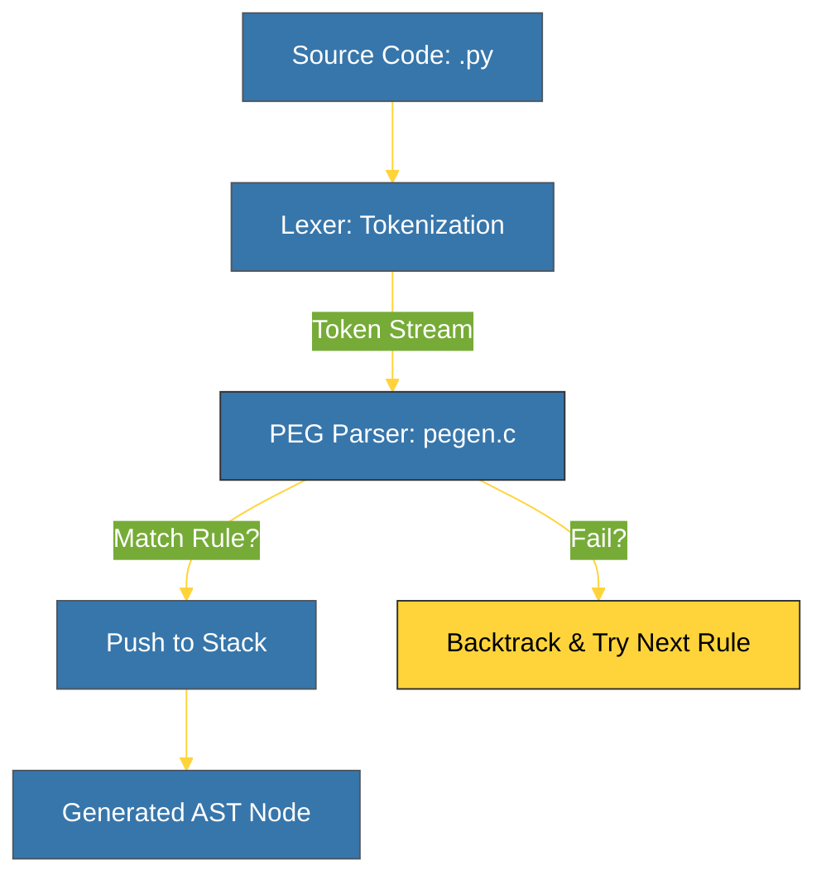

# BK-01: PEG Parser (The Gatekeeper) [x] Complete

> **"A language is only as powerful as its ability to understand what is being said. Python's PEG parser is that understanding."**

Buku ini membedah **PEG Parser**, gerbang depan CPython (sejak versi 3.9) yang bertanggung jawab menerjemahkan teks kode sumber Anda menjadi struktur logis. Kita akan mempelajari mengapa Python meninggalkan parser LL(1) tradisional dan beralih ke **Parsing Expression Grammar (PEG)** yang lebih fleksibel dan kuat.

---

## 🌐 Source Hub (Authority)
- **Primary Source**: [PEP 617 – New PEG parser for CPython](https://peps.python.org/pep-0617/)
- **Source Code**: [CPython Parser/pegen.c](https://github.com/python/cpython/blob/main/Parser/pegen.c)

---

## 🧠 The Essence (Narrative)
Sebelum Python 3.9, Python menggunakan parser LL(1) yang memiliki banyak keterbatasan (tidak bisa menangani aturan yang ambigu tanpa "hacks"). **PEG Parser** memecahkan ini dengan menggunakan pendekatan *top-down* yang mencoba mencocokkan aturan secara berurutan. Intisari dari bab ini adalah memahami bagaimana file tata bahasa (`Grammar/python.gram`) diubah secara otomatis menjadi kode C yang sangat efisien untuk melakukan pengenalan pola kode.

---

## 🎨 Visual Logic (PEG Parsing Flow)



---

## 🛠️ Implementation: The Token Gateway
Setiap baris kode Python terlebih dahulu dipecah menjadi token. Anda bisa melihat proses ini menggunakan modul `tokenize`:
```bash
python -m tokenize myscript.py
```
Hasilnya adalah urutan `NAME`, `OP`, `NUMBER`, dan `NEWLINE`. Parser kemudian mengambil token-token ini dan mencoba mencocokkannya dengan aturan tata bahasa (misal: `if_stmt`, `expr_stmt`).

---

## ⚠️ Pitfalls
- **Infinite Backtracking**: Meskipun PEG sangat kuat, aturan yang didefinisikan secara buruk dapat menyebabkan parser mencoba terlalu banyak kombinasi (backtracking), yang menurunkan performa. Itulah sebabnya Python menggunakan *memoization* (Packrat parsing).
- **Grammar Ambiguity**: Dalam PEG, urutan aturan sangat penting. Aturan pertama yang cocok akan diambil (`first-match wins`). Ini berbeda dengan parser CFG tradisional yang mungkin menemukan semua kemungkinan.
- **Left Recursion**: Secara teori, PEG tidak bisa menangani rekursi-kiri (`A -> A b`). Namun, parser CPython telah dimodifikasi secara khusus untuk mendukung ini guna memudahkan penulisan tata bahasa.

---
*Back to [SR-02 Parsing & AST](../README.md)*
