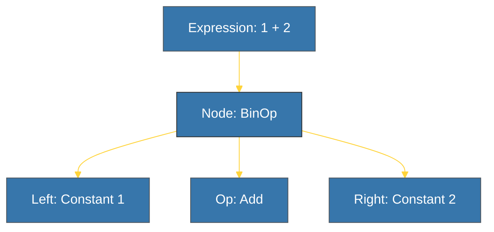

# BK-02: AST Generation (Abstract Syntax Tree) [x] Complete

> **"Code is not just text; it's a tree of intentions."**

Buku ini membedah **Abstract Syntax Tree (AST)**, struktur data yang merepresentasikan logika kode Anda tanpa detail sintaksis yang tidak perlu (seperti kurung atau spasi). Kita akan mempelajari bagaimana CPython menggunakan **ASDL** untuk mendefinisikan ribuan tipe node dan bagaimana Anda dapat memanipulasinya secara terprogram.

---

## 🌐 Source Hub (Authority)
- **Primary Source**: [Python Docs - ast (Abstract Syntax Trees)](https://docs.python.org/3/library/ast.html)
- **Source Code**: [CPython Python/ast.c](https://github.com/python/cpython/blob/main/Python/ast.c)

---

## 🧠 The Essence (Narrative)
Setelah Parser mengenali pola kode, ia menghasilkan **Concrete Parse Tree (CST)** yang berantakan. Tahap berikutnya adalah pembersihan melalui **AST Generation**. AST membuang tanda baca dan fokus pada hubungan semantik: "Siapa variabelnya?", "Apa operasinya?", dan "Ke mana hasilnya?". Di CPython, struktur AST didefinisikan menggunakan bahasa khusus bernama **ASDL** (Abstract Syntax Description Language) di file `Parser/Python.asdl`.

---

## 🎨 Visual Logic (Concrete vs Abstract)

| Aspect | Concrete Tree (CST) | Abstract Tree (AST) |
| :--- | :--- | :--- |
| **Granularity** | Termasuk spasi, kurung, token. | Hanya node fungsional. |
| **Complexity** | Sangat kompleks & berulang. | Ringkas & Hierarkis. |
| **Usage** | Validasi tata bahasa. | Kompilasi & Analisis Statis. |



---

## 🛠️ Implementation: Inspecting the Tree
Anda dapat melihat AST dari kode apa pun menggunakan modul bawaan `ast`:
```python
import ast

code = "x = 10 + 5"
tree = ast.parse(code)
print(ast.dump(tree, indent=4))
```
Outputnya akan menunjukkan struktur `Assign` node yang berisi `Name` (target) dan `BinOp` (value).

---

## ⚠️ Pitfalls
- **The Lineno Trap**: Saat memodifikasi AST secara manual (misal: untuk transformasi kode), jangan lupa untuk menyetel atribut `lineno` dan `col_offset`. Tanpa ini, compiler akan gagal menghasilkan bytecode.
- **Node Immutability**: Di level C, node AST bersifat permanen setelah dibuat. Namun di level Python (melalui modul `ast`), Anda bisa mengubahnya sesuka hati sebelum dikirim kembali ke compiler (menggunakan `compile()`).
- **AST version differences**: Node AST dapat berubah antar versi Python. Tooling yang bergantung pada AST (seperti `black` atau `flake8`) seringkali harus menangani perbedaan struktur antar versi minor.

---
*Back to [SR-02 Parsing & AST](../README.md)*
