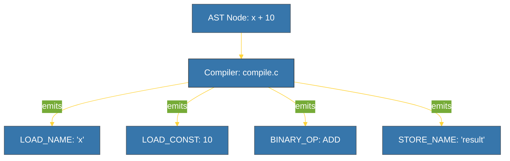

# BK-01: Bytecode Emitter (The Instruction Factory) [x] Complete

> **"A tree is an idea; bytecode is the command to execute that idea."**

Buku ini membedah **Bytecode Emitter**, komponen CPython yang bertanggung jawab menerjemahkan pohon logika (AST) menjadi urutan instruksi linier yang dapat dimengerti oleh mesin virtual. Kita akan mempelajari bagaimana instruksi tingkat rendah (Opcodes) dihasilkan dan bagaimana mereka dikemas ke dalam struktur **Code Object**.

---

## 🌐 Source Hub (Authority)
- **Primary Source**: [Python Docs - dis (Disassembler for Python bytecode)](https://docs.python.org/3/library/dis.html)
- **Source Code**: [CPython Python/compile.c](https://github.com/python/cpython/blob/main/Python/compile.c)

---

## 🧠 The Essence (Narrative)
Mesin Virtual Python (PVM) tidak mengerti AST. Ia membutuhkan instruksi sederhana ("Ambil variabel ini", "Tambahkan angka itu"). **Bytecode Emitter** melakukan traversal (penelusuran) pada pohon AST dan memancarkan (*emits*) instruksi yang sesuai. Hasil akhirnya bukan file biner mesin (seperti `.exe`), melainkan file biner perantara (`.pyc`) yang berisi **Code Object**. Code object ini adalah unit eksekusi yang berisi instruksi bytecode, daftar konstanta, dan nama variabel.

---

## 🎨 Visual Logic (AST to Bytecode)



---

## 🛠️ Implementation: Reading the Opcodes
Anda dapat membongkar (*disassemble*) fungsi apa pun untuk melihat bytecode internalnya menggunakan modul `dis`:
```python
import dis

def add(a, b):
    return a + b

dis.dis(add)
```
Hasilnya akan menunjukkan instruksi seperti `LOAD_FAST` (mengambil argumen lokal) dan `BINARY_OP` (melakukan operasi matematika).

---

## ⚠️ Pitfalls
- **Version Fragility**: Bytecode Python bersifat **tidak stabil** antar versi minor (misal: bytecode dari 3.10 tidak bisa dijalankan di 3.11). Inilah alasan mengapa Python selalu melakukan pengecekan "Magic Number" pada file `.pyc`.
- **Obfuscation Myth**: Meskipun bytecode sulit dibaca manusia, ia sangat mudah untuk di-decompile (dikembalikan ke source code) menggunakan alat seperti `uncompyle6`. Jangan menyimpan rahasia (password/API keys) di dalam bytecode.
- **Optimization Limit**: Compiler Python relatif sederhana dan tidak melakukan optimasi agresif seperti compiler C (GCC). Optimasi besar biasanya dilakukan di level desain kode oleh programmer, bukan oleh compiler bytecode.

---
*Back to [SR-03 Compilation & Bytecode](../README.md)*
