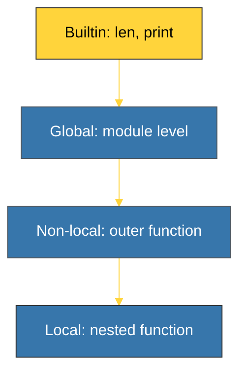

# BK-02: Symbol Table (Scoping Rules) [x] Complete

> **"A name is nothing without a scope; a scope is everything to a compiler."**

Buku ini membedah **Symbol Table**, komponen CPython yang bertanggung jawab mengidentifikasi identitas setiap nama (variabel, fungsi, class) dalam kode Anda. Kita akan mempelajari bagaimana compiler menentukan apakah sebuah variabel bersifat Lokal, Global, atau Non-lokal sebelum dieksekusi.

---

## 🌐 Source Hub (Authority)
- **Primary Source**: [Python Docs - symtable (Symbol table access)](https://docs.python.org/3/library/symtable.html)
- **Source Code**: [CPython Python/symtable.c](https://github.com/python/cpython/blob/main/Python/symtable.c)

---

## 🧠 The Essence (Narrative)
Python adalah bahasa dinamis, namun pemetaan cakupan variabel dilakukan **selama kompilasi** (secara statis). **Symbol Table** menganalisis penggunaan nama di seluruh blok kode. Saat compiler menemukan `x = 10`, ia harus memutuskan: "Apakah `x` ini variabel lokal baru, atau ia merujuk ke global?". Keputusan ini disimpan di dalam Code Object dan akan menentukan instruksi yang dikeluarkan (`LOAD_FAST` untuk lokal vs `LOAD_GLOBAL` untuk global). Memahami ini adalah kunci untuk menghindari eror klasik seperti `UnboundLocalError`.

---

## 🎨 Visual Logic (Scoping Hierarchy)



---

## 🛠️ Implementation: Inspecting Symbol Table
Anda dapat melihat bagaimana Python mengkategorikan variabel menggunakan modul `symtable`:
```python
import symtable

code = """
x = 10
def f():
    y = x + 5
    return y
"""
table = symtable.symtable(code, "example.py", "exec")
for sym in table.get_symbols():
    print(f"Name: {sym.get_name():<5} | Scope: {sym.is_global() and 'Global' or 'Local'}")
```

---

## ⚠️ Pitfalls
- **UnboundLocalError**: Terjadi karena Python mendeteksi assignment (`x = ...`) di dalam fungsi dan secara statis menandai `x` sebagai **Lokal**. Jika Anda mencoba membacanya sebelum assignment tersebut, Python akan bingung karena "pemuatan lokal gagal". Solusinya: gunakan kata kunci `global` atau `nonlocal`.
- **Global lookup cost**: Mengakses variabel global sedikit lebih lambat daripada variabel lokal. Hal ini karena variabel lokal disimpan di dalam array (berdasarkan indeks), sedangkan variabel global dicari di dalam dictionary module. Itulah sebabnya mengikat fungsi global ke variabel lokal (seperti `_len = len`) di dalam loop yang ketat dapat memberikan peningkatan performa.
- **Leaking Scope**: Di Python 3, `list comprehension` memiliki cakupan sendiri, sehingga variabel loop tidak "bocor" ke luar. Namun, loop `for` standar tetap meninggalkan variabel kursor di cakupan yang melingkupinya.

---
*Back to [SR-03 Compilation & Bytecode](../README.md)*
