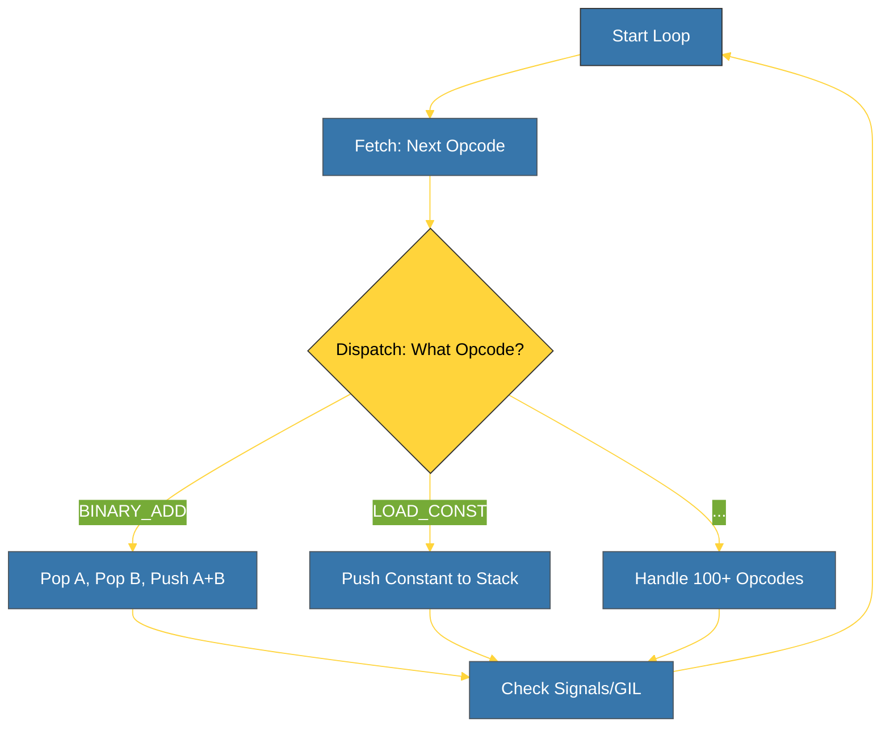

# BK-01: Ceval Anatomy (The Heart of Python) [x] Complete

> **"If Python has a heartbeat, it beats inside ceval.c."**

Buku ini membedah **`Python/ceval.c`**, file paling kritis dalam repositori CPython yang berisi loop evaluasi utama. Kita akan mempelajari bagaimana fungsi `_PyEval_EvalFrameDefault` mengambil instruksi bytecode dan mengeksekusinya satu per satu.

---

## 🌐 Source Hub (Authority)
- **Primary Source**: [CPython Source: Python/ceval.c](https://github.com/python/cpython/blob/main/Python/ceval.c)
- **Strategic Blueprint**: [RAK-06 Interpreters](file:///i:/Workspace/Workspace-Syahputrawork/01-Language-Hubs-Workspace/Python-Knowledge-Base/RAK-06-interpreters/README.md)

---

## 🧠 The Essence (Narrative)
Setelah compiler menghasilkan bytecode, mesin virtual (PVM) harus menjalankannya. Intisari dari bab ini adalah memahami **The Great Switch-Case**. Di dalam `ceval.c`, terdapat loop raksasa yang terus menerus melakukan tiga hal:
1.  **Fetch**: Mengambil opcode berikutnya dari aray bytecode.
2.  **Dispatch**: Mengarahkan eksekusi ke kode C yang sesuai untuk opcode tersebut (menggunakan `switch` atau *Computed Gotos*).
3.  **Execute**: Menjalankan logika C (misal: menjumlahkan dua angka) dan memperbarui stack.
Inilah tempat di mana "teks" benar-benar menjadi "aksi".

---

## 🎨 Visual Logic (The Evaluation Loop Cycle)



---

## 🛠️ Implementation: The C-Level Dispatcher
Di dalam `ceval.c`, Anda akan menemukan ribuan baris kode yang terlihat seperti ini (disederhanakan):
```c
// Python/ceval.c
for (;;) {
    opcode = NEXTOP();
    switch (opcode) {
        case TARGET(BINARY_ADD): {
            PyObject *right = POP();
            PyObject *left = TOP();
            PyObject *sum = PyNumber_Add(left, right);
            SET_TOP(sum);
            DISPATCH();
        }
        // ... hundreds of other cases
    }
}
```

---

## ⚠️ Pitfalls
- **The Giant Switch**: Karena loop ini sangat besar, performanya sangat bergantung pada kemampuan compiler C untuk mengoptimalkannya. CPython menggunakan "Computed Gotos" pada compiler yang mendukung (seperti GCC) untuk menghindari overhead pencabangan `switch`.
- **GIL Overhead**: Di dalam loop ini, setiap beberapa instruksi, Python akan memeriksa apakah ia harus melepaskan Global Interpreter Lock (GIL) untuk thread lain. Ini adalah titik di mana "multi-threading" Python dikelola secara internal.
- **Recursive Depth**: Setiap kali Anda memanggil fungsi Python, `ceval` akan memanggil dirinya sendiri secara rekursif (atau membuat stack frame baru). Jika terlalu dalam, Anda akan terkena `RecursionError` bukan karena memori habis, tapi karena batas keamanan yang ditetapkan di `ceval`.

---
*Back to [SR-04 Eval Loop](../README.md)*
