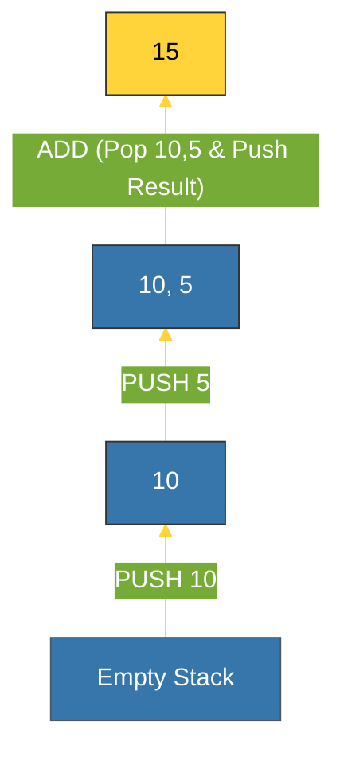

# BK-02: Stack Machine (Execution Frame) [x] Complete

> **"Registers are for the hardware; stacks are for the language designers."**

Buku ini membedah **Stack Machine**, inti dari Mesin Virtual Python (PVM) yang mengoperasikan bytecode. Kita akan mempelajari bagaimana **`PyFrameObject`** mewakili konteks eksekusi dan bagaimana Python menggunakan stack untuk melakukan perhitungan tanpa register perangkat keras.

---

## 🌐 Source Hub (Authority)
- **Primary Source**: [CPython Source: Include/frameobject.h](https://github.com/python/cpython/blob/main/Include/frameobject.h)
- **Strategic Blueprint**: [RAK-06 Interpreters](file:///i:/Workspace/Workspace-Syahputrawork/01-Language-Hubs-Workspace/Python-Knowledge-Base/RAK-06-interpreters/README.md)

---

## 🧠 The Essence (Narrative)
Python adalah **Stack-based Virtual Machine**. Tidak seperti CPU fisik (yang menyimpan data di Register), PVM menyimpan data di **Value Stack**. Setiap kali Anda melakukan operasi (misal: `a + b`), Python tidak melakukan `ADD R1, R2`; ia melakukan:
1.  **PUSH** `a` (Masukkan `a` ke atas tumpukan).
2.  **PUSH** `b` (Masukkan `b` di atas `a`).
3.  **BINARY_ADD** (Ambil dua barang teratas, jumlahkan, kembalikan hasilnya ke tumpukan).
Intisari dari bab ini adalah memahami struktur **Frame** yang membungkus stack ini beserta variabel lokal dan globalnya.

---

## 🎨 Visual Logic (Push/Pop Execution)

| State | Operation | Stack Content |
| :--- | :--- | :--- |
| **Step 1** | `LOAD_CONST: 10` | `[ 10 ]` |
| **Step 2** | `LOAD_CONST: 5` | `[ 10, 5 ]` |
| **Step 3** | `BINARY_OP: ADD` | `[ 15 ]` |
| **Step 4** | `STORE_NAME: 'x'` | `[ ]` (Stack is empty) |



---

## 🛠️ Implementation: The PyFrameObject
Setiap pemanggilan fungsi menciptakan **Frame** baru. Anda bisa melihat metadata frame saat ini menggunakan modul `sys`:
```python
import sys

def check_stack():
    frame = sys._getframe()
    print(f"   [FRAME] File: {frame.f_code.co_filename}")
    print(f"   [FRAME] Locals: {frame.f_locals}")
    print(f"   [FRAME] Instruction Pointer: {frame.f_lasti}")

check_stack()
```
Frame menyimpan **`f_back`** (referensi ke frame sebelumnya), **`f_locals`**, dan penunjuk ke bytecode yang sedang berjalan.

---

## ⚠️ Pitfalls
- **Stack Depth Limit**: Karena setiap frame memakan memori, Python memiliki batas kedalaman rekursi untuk mencegah stack overflow pada level C.
- **Copying Overhead**: Meskipun stack sangat efisien untuk instruksi sederhana, memindahkan objek besar masuk dan keluar stack dapat menyebabkan overhead jika dilakukan terlalu sering (meskipun yang dipindahkan hanyalah pointer `PyObject*`).
- **Dynamic Scoping Risk**: Jika sebuah nama tidak ditemukan di `f_locals`, Python harus mencarinya di `f_globals`, lalu `f_builtins`. Proses pencarian bertingkat ini terjadi di dalam eval loop dan dapat mempengaruhi performa fungsi yang berulang-ulang mengakses global variabel.

---
*Back to [SR-04 Eval Loop](../README.md)*
