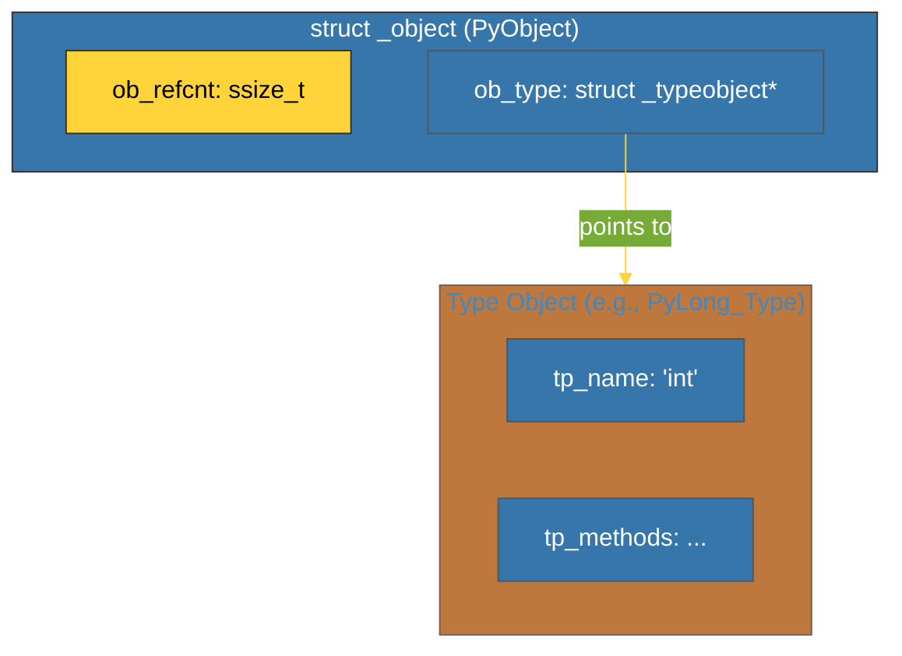

# BK-01: PyObject Struct (The Atomic Base) [x] Complete

> **"In the beginning, there was PyObject. And from it, all things were made."**

Buku ini membedah **`PyObject`**, struktur data C yang menjadi fondasi atomik dari setiap objek dalam Python. Kita akan mempelajari bagaimana data minimalis ini mengelola memori melalui *Reference Counting* dan bagaimana ia menghubungkan setiap instans dengan tipenya.

---

## 🌐 Source Hub (Authority)
- **Primary Source**: [CPython Source: Include/object.h](https://github.com/python/cpython/blob/main/Include/object.h)
- **Strategic Blueprint**: [RAK-06 Interpreters](file:///i:/Workspace/Workspace-Syahputrawork/01-Language-Hubs-Workspace/Python-Knowledge-Base/RAK-06-interpreters/README.md)

---

## 🧠 The Essence (Narrative)
Dalam Python, "semuanya adalah objek". Secara fisik, ini berarti setiap objek yang Anda buat (Integer, String, Class) diawali dengan struktur yang sama di memori C: **`PyObject`**. Struktur ini sangat hemat, hanya berisi dua hal:
1.  **`ob_refcnt`**: Angka yang mencatat berapa banyak tempat yang merujuk ke objek ini. Jika nol, objek dihapus.
2.  **`ob_type`**: Pointer ke objek lain yang mendefinisikan "siapa saya" (misal: "Saya adalah sebuah Integer").
Intisari dari bab ini adalah memahami bahwa setiap variabel Python sebenarnya adalah pemacu (*pointer*) ke struktur `PyObject` ini di dalam *heap* memori.

---

## 🎨 Visual Logic (PyObject Memory Layout)



---

## 🛠️ Implementation: The Header Definition
Di dalam `Include/object.h`, Anda akan menemukan definisi makro yang mendasari setiap objek:
```c
// Include/object.h
typedef struct _object {
    _PyObject_HEAD_EXTRA    // Digunakan untuk pelacakan GC
    Py_ssize_t ob_refcnt;   // Reference count
    struct _typeobject *ob_type; // Pointer ke objek tipe
} PyObject;
```
Semua objek tingkat tinggi (seperti `PyListObject`) selalu menyertakan `PyObject ob_base;` di baris pertama struktur mereka agar bisa di-*cast* menjadi `PyObject*`.

---

## ⚠️ Pitfalls
- **Reference Leaks**: Jika Anda menulis ekstensi C dan lupa memanggil `Py_DECREF()`, `ob_refcnt` tidak akan pernah mencapai nol, dan objek tersebut akan "bocor" (tetap di memori selamanya).
- **Type Confusion**: Melewatkan objek ke fungsi C-API yang mengharapkan tipe tertentu tanpa melakukan pengecekan tipe (via `PyCheck_...`) dapat menyebabkan *segmentation fault* instan karena Python mencoba mengakses memori yang tidak ada.
- **Borrowed References**: Memahami kapan Anda "memiliki" referensi vs hanya "meminjam" adalah perbedaan antara kode yang stabil dan crash yang sulit dilacak.

---
*Back to [SR-05 Object C-API](../README.md)*
