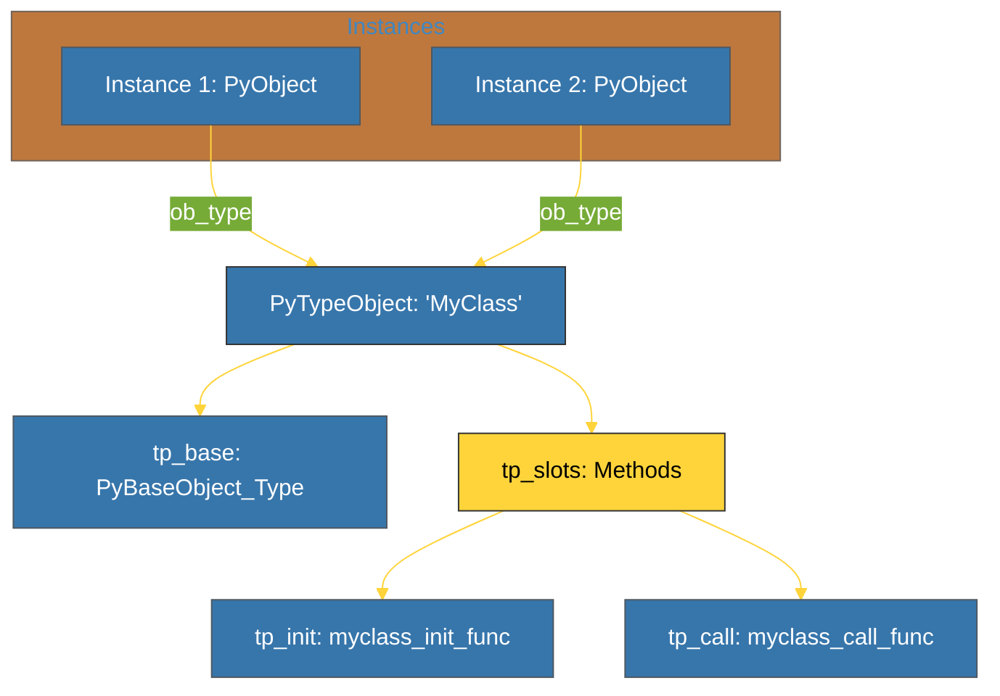

# BK-02: Type Objects (tp_slots & Inheritance) [x] Complete

> **"If PyObject is the instance, PyTypeObject is the blueprint that gives it meaning."**

Buku ini membedah **`PyTypeObject`**, raksasa di balik layar yang mendefinisikan perilaku dari setiap kelas di Python. Kita akan mempelajari bagaimana slot-slot di dalam struktur C (`tp_slots`) memetakan metode Python ke fungsi C yang cepat serta bagaimana pewarisan dikelola di level mesin.

---

## 🌐 Source Hub (Authority)
- **Primary Source**: [CPython Source: Include/typeobject.h](https://github.com/python/cpython/blob/main/Include/typeobject.h)
- **Strategic Blueprint**: [RAK-06 Interpreters](file:///i:/Workspace/Workspace-Syahputrawork/01-Language-Hubs-Workspace/Python-Knowledge-Base/RAK-06-interpreters/README.md)

---

## 🧠 The Essence (Narrative)
Saat Anda memanggil fungsi pada objek (misal: `x.draw()`), Python tidak mencari file teks; ia mencari di dalam **Type Object**. Intisari dari bab ini adalah memahami struktur **`PyTypeObject`** yang berisi ratusan "lubang" (*slots*) untuk fungsi C:
1.  **`tp_name`**: Nama kelas (misal: "int", "str").
2.  **`tp_new` / `tp_init`**: Fungsi C untuk membuat instans baru.
3.  **`tp_as_number` / `tp_as_sequence`**: Sekelompok fungsi yang mendefinisikan apakah objek bisa dijumlahkan atau di-indeks.
Inilah cara Python menjembatani sintaks dinamis ke eksekusi C yang statis dan sangat efisien.

---

## 🎨 Visual Logic (Type Object Hierarchy)



---

## 🛠️ Implementation: Inspecting Types
Anda bisa melihat tipe dari objek apa pun, dan bahkan melihat "MRO" (Method Resolution Order) yang disimpan di dalam `tp_mro` di level C:
```python
class A: pass
class B(A): pass

print(f"   [TYPE] B's base is: {B.__base__}")
print(f"   [MRO]  Search order: {B.mro()}")
```

---

## ⚠️ Pitfalls
- **Type Mutability**: Secara default, tipe bawaan (`int`, `str`) adalah **Immutable** di level C. Anda tidak bisa menambahkan metode ke `int` secara dinamis. Namun, kelas yang Anda buat di Python bersifat **Mutable** melalui mekanisme `tp_dict` yang kompleks.
- **Slot Conflict**: Saat melakukan pewarisan ganda (*multiple inheritance*), Python harus memastikan tidak ada konflik antara slot C yang berbeda. Algoritma C3 Linearization digunakan untuk menyelesaikan urutan pencarian ini.
- **Memory Layout Mismatch**: Jika Anda mewarisi dari dua kelas C yang memiliki tata letak memori yang berbeda (misal: `int` dan `list`), Python akan melemparkan kesalahan `TypeError: multiple bases have instance lay-out conflict`. Ini adalah salah satu batasan fisik dari interpreter C.

---
*Back to [SR-05 Object C-API](../README.md)*
