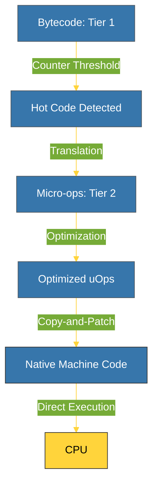

# BK-01: JIT Internals (Python 3.13+) [x] Complete

> **"A Just-In-Time compiler is like a pro athlete: it studies the game in real-time and adapts its strategy for maximum speed."**

Buku ini membedah **JIT (Just-In-Time) Compiler**, inovasi terbesar dalam CPython 3.13. Kita akan mempelajari bagaimana Python bertransformasi dari sekadar penafsir bytecode menjadi mesin yang mampu menghasilkan kode mesin secara dinamis menggunakan teknik **Copy-and-Patch**.

---

## 🌐 Source Hub (Authority)
- **Primary Source**: [PEP 744 – JIT Compilation](https://peps.python.org/pep-0744/)
- **Strategic Blueprint**: [RAK-06 Interpreters](file:///i:/Workspace/Workspace-Syahputrawork/01-Language-Hubs-Workspace/Python-Knowledge-Base/RAK-06-interpreters/README.md)

---

## 🧠 The Essence (Narrative)
Secara tradisional, CPython adalah interpreter murni yang lambat karena harus melakukan `switch-case` untuk setiap instruksi. Pada versi 3.13, diperkenalkan arsitektur **Tiered Execution**:
1.  **Tier 1**: Bytecode interpreter standar (dengan optimasi *Specialization*).
2.  **Tier 2**: Jika sebuah blok kode dijalankan berkali-kali ("Hot Code"), ia diterjemahkan menjadi **Micro-ops (uOps)**.
3.  **JIT Stage**: Micro-ops ini kemudian dikompilasi menjadi kode mesin asli (Native Machine Code) menggunakan generator **Copy-and-Patch**.
Intisari dari bab ini adalah memahami bagaimana Python "belajar" dan mengoptimalkan diri saat program sedang berjalan.

---

## 🎨 Visual Logic (JIT Compilation Pipeline)



---

## 🛠️ Implementation: Enabling JIT
JIT di Python 3.13 bersifat eksperimental dan harus diaktifkan saat pembuataan (*build time*):
```bash
# Contoh konfigurasi build dengan JIT
./configure --enable-experimental-jit=yes
make -j8
```
Setelah aktif, Python akan secara otomatis memantau loop dan fungsi yang sering dipanggil untuk ditingkatkan ke Tier 2.

---

## ⚠️ Pitfalls
- **Memory Consumption**: JIT membutuhkan memori tambahan untuk menyimpan kode mesin yang dihasilkan. Untuk skrip yang sangat singkat, JIT mungkin justru menambah beban (*overhead*) daripada mempercepat.
- **Complexity of Debugging**: Melacak bug di dalam kode yang dihasilkan secara dinamis oleh JIT jauh lebih sulit daripada melacak bytecode standar. Tooling seperti `gdb` memerlukan dukungan khusus.
- **Building Requirement**: Untuk membangun Python dengan JIT, sistem Anda membutuhkan compiler C modern (seperti LLVM/Clang) yang tersedia selama proses pembuataan. Tanpa ini, JIT tidak dapat dibangun.

---
*Back to [SR-06 Modern Internals](../README.md)*
