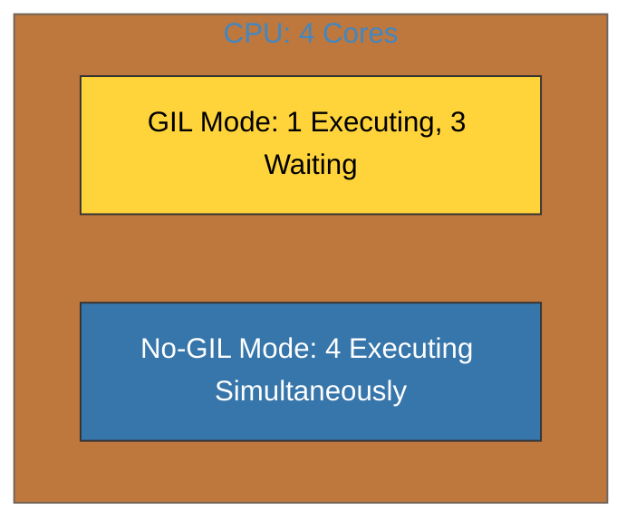

# BK-02: Free-threading (PEP 703: No-GIL) [x] Complete

> **"Removing the GIL is like removing the traffic light at a busy intersection; you get more flow, but you need better lanes."**

Buku ini membedah **Free-threading**, tonggak sejarah dalam CPython 3.13 yang memungkinkan penghapusan **Global Interpreter Lock (GIL)**. Kita akan mempelajari bagaimana Python mencapai paralelisme sejati melalui teknik **Biased Reference Counting** dan penguncian per-objek yang presisi.

---

## 🌐 Source Hub (Authority)
- **Primary Source**: [PEP 703 – Making the Global Interpreter Lock Optional in CPython](https://peps.python.org/pep-0703/)
- **Strategic Blueprint**: [RAK-06 Interpreters](file:///i:/Workspace/Workspace-Syahputrawork/01-Language-Hubs-Workspace/Python-Knowledge-Base/RAK-06-interpreters/README.md)

---

## 🧠 The Essence (Narrative)
Selama 3 dekade, GIL adalah "polisi" yang memastikan hanya satu thread yang mengeksekusi bytecode Python. Dengan **Free-threading (No-GIL)**, polisi ini diberhentikan. Sebagai gantinya, setiap objek sekarang memiliki "gembok" sendiri (penguncian halus). Intisari dari bab ini adalah memahami **Biased Reference Counting**: teknik di mana thread pemilik objek tidak menggunakan interlocked instructions (cepat), sementara thread lain tetap menggunakannya (lambat tapi aman). Inilah harga yang harus dibayar demi mendapatkan skalabilitas multi-core yang linear.

---

## 🎨 Visual Logic (GIL vs Free-threading)

| Aspect | GIL Threading | Free-threading (No-GIL) |
| :--- | :--- | :--- |
| **Parallelism** | Simulasi (Concurrency) | Sejati (True Parallel) |
| **Scaling** | Terjebak di 1 Core | Skalabilitas Multi-Core |
| **Logic** | Global Lock (Easy) | Per-object Locking (Scalable) |



---

## 🛠️ Implementation: Running No-GIL
Mode ini tersedia melalui build khusus di Python 3.13. Anda bisa mengecek apakah Python Anda berjalan dalam mode free-threading:
```python
import sys
# Cek flag di sys.flags
print(sys.flags.nogil) # Akan bernilai True jika No-GIL aktif
```
Jika aktif, modul `threading` benar-benar akan menjalankan kode secara paralel di core CPU yang berbeda tanpa hambatan kunci global.

---

## ⚠️ Pitfalls
- **C-Extension Compatibility**: Banyak library C pihak ketiga (seperti NumPy versi lama) belum sepenuhnya aman untuk mode No-GIL. Menggunakan modul yang tidak kompatibel dapat menyebabkan crash instan.
- **Single-Thread Performance**: Karena mekanisme `Biased Reference Counting` yang lebih kompleks, program yang hanya menggunakan satu thread mungkin akan berjalan **10-15% lebih lambat** daripada versi GIL standar. No-GIL adalah pertukaran antara kecepatan per core demi total throughput sistem.
- **Race Condition Danger**: Dengan hilangnya GIL, tanggung jawab untuk mencegah race condition pada variabel global kini sepenuhnya ada di tangan programmer (melalui penggunaan manajer kunci manual).

---
*Back to [SR-06 Modern Internals](../README.md)*
