# BK-01: Polars Mastery (Beyond Pandas) [x] Complete

> **"Data is the new oil, and Polars is the high-performance refinery that processes it 100x faster than traditional tools."**

Buku ini membedah **Polars**, library pemrosesan data tercepat di ekosistem Python saat ini. Kita akan mempelajari bagaimana mesin berbasis Rust dan format memori Apache Arrow memungkinkan Python melakukan analisis data skala besar tanpa hambatan memori yang biasa ditemukan di Pandas.

---

## 🌐 Source Hub (Authority)
- **Primary Source**: [Polars Official Documentation](https://docs.pola.rs/)
- **Comparison**: [Polars vs Pandas Benchmarks](https://www.pola.rs/benchmarks.html)

---

## 🧠 The Essence (Narrative)
Pandas adalah legenda, namun ia memiliki desain "Eager Execution" (setiap operasi langsung memakan memori). **Polars** memperkenalkan **Lazy Evaluation**. Alih-alih langsung menjalankan perintah, Polars membangun "Query Plan" yang dioptimalkan sebelum dijalankan. Intisari dari bab ini adalah memahami **The Arrow Advantage**: data disimpan secara bertetangga di memori, memungkinkan CPU menggunakan instruksi SIMD (Single Instruction, Multiple Data) untuk memproses ribuan angka dalam satu detak jam.

---

## 🎨 Visual Logic (Eager vs Lazy Execution)

```mermaid
%%{init: {'theme': 'base', 'themeVariables': { 'primaryColor': '#FFD43B', 'primaryTextColor': '#000', 'lineColor': '#3776AB'}}}%%
graph TD
    subgraph Eager_Pandas["Eager (Pandas/NumPy)"]
        E1[Load Data 1GB] -->|Wait| E2[Filter Rows]
        E2 -->|Wait| E3[Select Columns]
        E3 -->|Done| EOutput[Result]
    end
    
    subgraph Lazy_Polars["Lazy (Polars)"]
        L1[Scan File] -.->|Register| L2[Filter Rule]
        L2 -.->|Register| L3[Select Rule]
        L3 -->|Optimized Execution| LOutput[Result]
    end
    
    style Lazy_Polars fill:#FFD43B,stroke:#333,color:#000
    style Eager_Pandas fill:#eee,stroke:#999,color:#666
```



---

## 🛠️ Implementation: The High-Performance Pipeline
```python
import polars as pl

# 1. Lazy Scan (Hanya membaca metadata)
df = pl.scan_csv("data_raksasa.csv")

# 2. Pipeline Definition (Query Plan)
query = (
    df.filter(pl.col("salary") > 50000)
      .group_by("department")
      .agg(pl.col("performance").mean())
      .select(["department", "performance"])
)

# 3. Execution (Optimized & Parallel)
result = query.collect()
print(result)
```

---

## ⚠️ Pitfalls
- **The .collect() Trap**: Jika Anda menggunakan Lazy API, data tidak akan benar-benar diproses hingga Anda memanggil `.collect()`. Jangan lupa memanggil ini di akhir pipeline Anda.
- **API Dialects**: Sintaks Polars menggunakan ekspresi (`pl.col()`) yang mungkin terasa asing bagi pengguna Pandas veteran. Namun, ini lebih aman karena menghindari "SettingWithCopyWarning" yang sering muncul di Pandas.
- **Memory Spikes**: Meskipun efisien, menjalankan operasi berat pada dataset yang lebih besar dari RAM tanpa menggunakan `streaming=True` saat `.collect()` tetap dapat menyebabkan *Out of Memory* (OOM).

---
*Back to [SR-01 Modern Data Stack](../README.md)*
